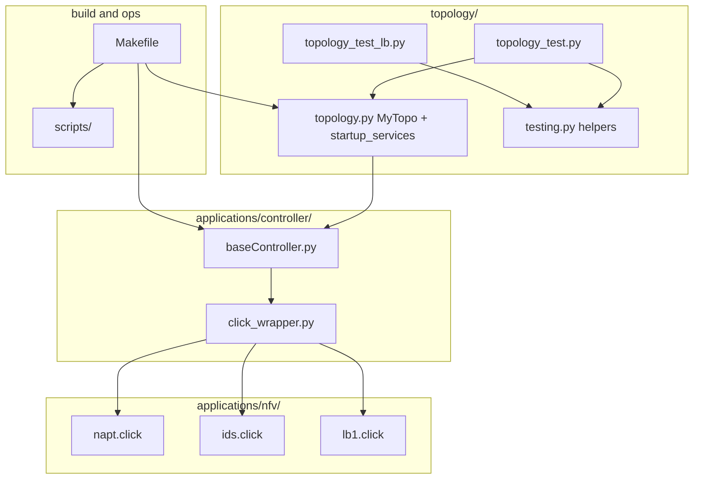

# Project documentation (IK2221 Phase 1)

Subsystem reviews for this repository. Each page summarizes **design intent**, **how it maps to the course brief**, and **where to look in code**, informed by a pass over the tree (topology, POX, Click NFVs, build/test/VM helpers).

## Document map

| Document | Scope |
|----------|--------|
| [topology-and-testing.md](topology-and-testing.md) | Mininet `MyTopo`, addressing, `startup_services`, automated tests, LB-only topology |
| [controller-and-click-wrapper.md](controller-and-click-wrapper.md) | POX `baseController`, DPID routing, `click_wrapper` process model |
| [nfv-napt.md](nfv-napt.md) | Click NAPT: zones, ARP, TCP/ICMP rewrite, counters |
| [nfv-ids.md](nfv-ids.md) | Click IDS: three ports, HTTP policy, diversion to `insp` |
| [nfv-load-balancer.md](load_balancer.md) | Click LB: VIP, round-robin, proxy-ARP, ICMP (deep element-level notes) |
| [build-test-and-vm.md](build-test-and-vm.md) | `Makefile` targets, `phase_1_report`, VM sync/run scripts |

## System context (subsystem view)

For a single end-to-end path from hosts to backends, see the [root README](../README) Mermaid figures.
