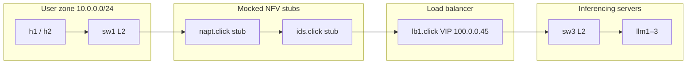
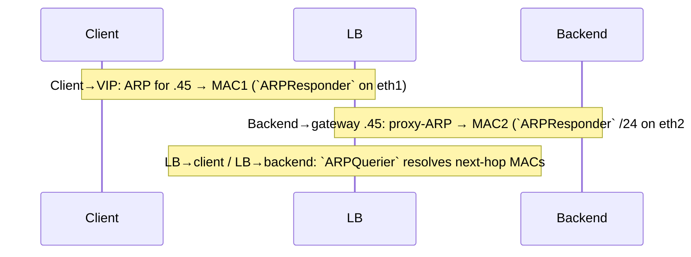
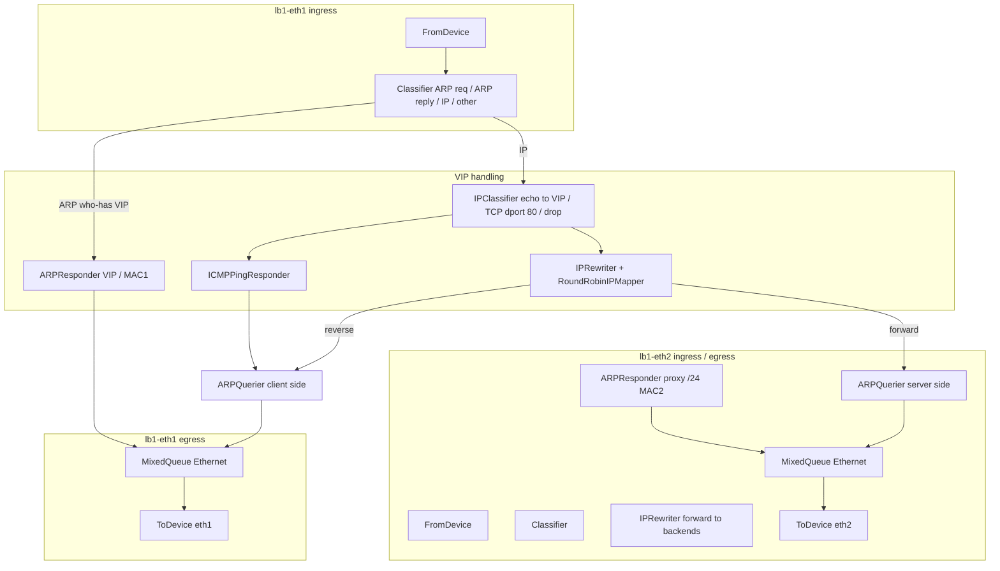

# Load balancer (`lb1`) — design, mocks, and testing

This document explains the **Click load balancer** for IK2221 Phase 1: how traffic reaches the **VIP**, why **ARP** matters on both sides of the NFV, how **`IPRewriter`** balances **HTTP/TCP** across backends, and where that behavior lives **in code**. It also covers **mocked** NAPT/IDS stubs and **LB-only** tests on the course VM.

## Role in the full project



- **Mocks (`napt.click`, `ids.click`)** — today they are **transparent L2 bridges** so you can focus on **`lb1.click`** and on Mininet addressing without implementing NAPT/IDS yet.
- **Real submission** — replace mocks with full Click NFVs; keep **interface names** (`napt-eth*`, `ids-eth*`, `lb1-eth*`) aligned with Mininet port order.

## How it works: IP vs MAC, ARP, and the VIP

**IP addresses** identify hosts for routing; **Ethernet (L2)** delivers frames **to a MAC address** on the local link. Before the client can send a TCP segment to **100.0.0.45** (the VIP), it must resolve **which MAC** on the LAN owns that IPv4 address. **ARP** performs that mapping: broadcast “who has 100.0.0.45?”, receive a unicast reply with the answer, then cache **IP → MAC** for a while.

This LB is implemented in **Click** on the **`lb1`** node, with two Linux interfaces **`lb1-eth1`** (client / IDS direction) and **`lb1-eth2`** (toward **`sw3`** and the LLMs). Click **answers ARP on eth1** for the **VIP /32** with **MAC1** so clients send traffic to the load balancer’s **client-side** Ethernet address. Outbound rewritten traffic and **return** traffic use **eth2**; **`ARPQuerier(lb1_server)`** encapsulates IP toward backends using **MAC2** as the LB’s source on that segment.

On the **server** side, backends are configured with **default route via 100.0.0.45** (same `/24`). They therefore **ARP for the gateway IP** when sending return traffic toward the client. **`ARPResponder(100.0.0.0/24 …)` on eth2** implements **proxy-ARP**: it answers ARP for **any** address in that subnet with **MAC2**, so replies are **delivered to the LB** instead of being dropped or mis-forwarded. Those packets then hit **`IPRewriter` input 1**, which rewrites addresses so the **client still sees the VIP** as the server. (In the **full** topology, the same mechanism supports return traffic that would otherwise target **100.0.0.1** on the NAPT inferencing side; see the comment block at the top of `applications/nfv/lb1.click`.)

**TCP through the rewriter:** New **client → VIP:80** flows enter **`IPRewriter` input 0**. The **`RoundRobinIPMapper`** picks the next backend among **100.0.0.40–42:80**, rewrites the **destination** IP (and installs a mapping), and packets leave **`tcp_rw` output 0** toward **eth2**. Return **TCP from a backend** enters **eth2**, goes to **`IPRewriter` input 1**, hits the **reverse** mapping, and exits **output 1** toward **`ARPQuerier(lb1_client)`** and the client.

## Sequence diagrams

### 1. ARP so the client can reach the VIP (eth1)

```mermaid
sequenceDiagram
autonumber
participant C as Client (e.g. hc)<br/>100.0.0.100
participant LAN as L2 switches<br/>(broadcast domain)
participant LB as LB (Click on lb1)<br/>VIP 100.0.0.45<br/>eth1 MAC1

C->>LAN: ARP Request: who has 100.0.0.45?
LAN->>LB: flood to all ports
LB-->>LAN: ARP Reply: 100.0.0.45 → MAC1
LAN-->>C: reply delivered
Note over C: Cache IP→MAC;<br/>Ethernet unicast to MAC1
```

### 2. HTTP/TCP through VIP → rewriter → backend → client

```mermaid
sequenceDiagram
autonumber
participant C as Client
participant LB as LB (Click)<br/>VIP .45 · IPRewriter
participant B as Backend<br/>llm1 / llm2 / llm3

Note over C,B: TCP handshake toward VIP; LB maps flow to one backend

C->>LB: SYN dst VIP:80 (Ethernet to MAC1)
LB->>LB: RoundRobin · rewrite IPv4 dst → backend
LB->>B: SYN toward chosen llm:N (eth2)

B->>LB: SYN-ACK (via gateway ARP → MAC2 on eth2)
LB->>LB: reverse mapping · src → VIP:80
LB->>C: SYN-ACK as from VIP:80

C->>LB: ACK
LB->>B: ACK (forward mapping)

Note over C,B: HTTP GET / response same logical path

C->>LB: GET http://VIP/index.html
LB->>B: GET (dst rewritten)
B->>LB: HTTP 200 …
LB->>C: HTTP 200 … (src rewritten to VIP)
```

### 3. Where ARP appears (conceptual)



In **`topology/topology_test_lb.py`**, Mininet is built with **`autoStaticArp=True`**, so **neighbor caches may be pre-filled** and you might see fewer ARP broadcasts than on a live LAN; the **logical** order is unchanged.

## System design (grounded in code)

### Topology and addressing

**LB-only Mininet graph** — `topology/topology_test_lb.py` defines **`LbOnlyTopo`**: host **`hc`** (`100.0.0.100/24`, default via **`100.0.0.45`**), **`sw0`**, **`lb1`** (DPID 6), **`sw3`**, and **`llm1–llm3`** at **`100.0.0.40–42`**, each with default route via **`100.0.0.45`**. **`startup_lb_only`** starts minimal Python HTTP servers on the backends and aligns **`lb1`** kernel MACs with the Click config:

```66:67:topology/topology_test_lb.py
    lb.cmd("ip link set dev lb1-eth1 address 02:00:00:00:01:45 2>/dev/null || true")
    lb.cmd("ip link set dev lb1-eth2 address 02:00:00:00:02:45 2>/dev/null || true")
```

The **full-course** topology uses **`startup_services(net)`** in `topology/topology.py`, which performs the **same `ip link set`** on **`lb1-eth1`** / **`lb1-eth2`** when that node exists—keep kernel MACs in sync with **`MAC1` / `MAC2`** in `lb1.click` so Ethernet headers match what **`ARPResponder`** and **`AddressInfo`** advertise.

### Controller lifecycle (when Click starts)

POX **`baseController`** treats DPID **`6`** as the load balancer **NFV**: after **`lb1-eth1`** appears in sysfs, it launches **`lb1.click`** via **`click_wrapper.start_click`**. Report and stderr paths default under **`/tmp`** but can be overridden with **`IK2221_LB_REPORT`** and **`IK2221_LB_STDERR`**:

```44:55:applications/controller/baseController.py
        elif id == 6:
            log.info("Starting Load Balancer - waiting for lb1-eth1 to appear...")
            for i in range(20):
                if os.path.exists('/sys/class/net/lb1-eth1'):
                    break
                time.sleep(1)
            log.info("LB interface ready, starting Click")
            lb_out = os.environ.get("IK2221_LB_REPORT", "/tmp/lb1.report")
            lb_err = os.environ.get("IK2221_LB_STDERR", "/tmp/lb1.stderr")
            self.devices[id] = click_wrapper.start_click(
                "/opt/pox/ext/lb1.click", "", lb_out, lb_err
            )
```

DPIDs **`1–3`** remain **learning switches** (`forwarding.l2_learning.LearningSwitch`); **`4`** / **`5`** start NAPT / IDS Click graphs when present.

### Data plane: `applications/nfv/lb1.click`

| Concern | Code anchor |
|---------|-------------|
| Devices + VIP MAC binding | **`AddressInfo(lb1_client … $MAC1, lb1_server … $MAC2)`** |
| Backend pool | **`RoundRobinIPMapper`** patterns **`100.0.0.40–42:80`** |
| Connection tracking + rewrite | **`tcp_rw :: IPRewriter(rr, pass 1)`** — input 0 new flows, input 1 server return |
| Client-side ARP for VIP | **`ARPResponder($VIP/32 $MAC1)`** on **eth1** ingress |
| Server-side proxy-ARP | **`ARPResponder(100.0.0.0/24 $MAC2)`** on **eth2** ingress |
| Encapsulation toward peers | **`ARPQuerier(lb1_client)`** / **`ARPQuerier(lb1_server)`** |
| ICMP ping to VIP | **`ICMPPingResponder`** → **`arq1`** (same push fan-in as TCP reverse) |
| Per-interface egress multiplexing | **`MixedQueue`** before **`ToDevice`** (ARP replies vs **`ARPQuerier`** pull chain) |

Core definitions:

```19:38:applications/nfv/lb1.click
AddressInfo(
  lb1_client  $VIP  100.0.0.0/24  $MAC1,
  lb1_server  $VIP  100.0.0.0/24  $MAC2
);

// Round-robin mapper: new client→VIP flows are distributed across the three backends.
// Pattern format: SADDR SPORT DADDR DPORT FOUTPUT ROUTPUT
// "-" keeps the original field. Forward exits at 0, reverse at 1.
rr :: RoundRobinIPMapper(
  - - 100.0.0.40 80 0 1,
  - - 100.0.0.41 80 0 1,
  - - 100.0.0.42 80 0 1
);

// IPRewriter input 0: new client flows (apply rr mapper).
// IPRewriter input 1: server return flows (hit reverse mapping, rewrite src back to VIP).
tcp_rw :: IPRewriter(rr, pass 1);

arq1 :: ARPQuerier(lb1_client);   // resolves MACs on the client/IDS side
arq2 :: ARPQuerier(lb1_server);   // resolves MACs on the server/sw3 side
```

**Ethernet ingress** uses **`Classifier`** to split ARP request / reply / IPv4 / other; **`IPClassifier`** on eth1 selects **ICMP echo to VIP**, **TCP dport 80 to VIP**, or drop. **`DriverManager`** prints counters (ARP, service TCP, drops, **`mapping_failures`**) when Click exits—useful alongside **`IK2221_LB_REPORT`**.

### Automated LB-only tests

**`topology/topology_test_lb.py`** — **`run_lb_tests`** pings the VIP, performs **`curl`** **`GET`** `http://100.0.0.45/index.html`, and expects responses mentioning **`llm1`**, **`llm2`**, and **`llm3`** across repeated GETs (round-robin visibility).

## LB placement and Linux interfaces

| Click device | Faces | Notes |
|--------------|--------|--------|
| `lb1-eth1` | IDS / client direction | ARP + IP toward VIP enter here. |
| `lb1-eth2` | `sw3` / backends | Rewritten packets to `100.0.0.40–42` exit here; return traffic re-enters here. |

**Important:** **`ARPResponder`** advertises **MAC1** for the VIP on **eth1** and uses **MAC2** as the LB identity on **eth2**. **`ip link set`** on **`lb1`** must set **`lb1-eth1`** to **MAC1** and **`lb1-eth2`** to **MAC2** so the Linux stack accepts unicasts consistent with Click’s **`AddressInfo`**.

## Internal packet flow (conceptual)



## Click graph highlights (`lb1.click`)

1. **Ethernet classification** — `Classifier(12/0806 20/0001, …)` splits ARP requests, ARP replies, IPv4, and **drops** non-IP/non-ARP (per LB scope).
2. **ARP for VIP** — `ARPResponder(100.0.0.45/32 …)` on **eth1** answers “who-has **100.0.0.45**?” with **MAC1**. **Eth2** uses **`ARPResponder(100.0.0.0/24 …)`** for proxy-ARP with **MAC2**.
3. **TCP to VIP:80** — `IPRewriter(RoundRobinIPMapper(…), pass 1)`:
   - For **every input port**, Click first looks up the packet in the **mapping table**; only if there is no mapping does it apply that port’s `INPUTSPEC` (`rr` on input 0, `pass 1` on input 1).
   - **Input 0** — new client→VIP flows: `RoundRobinIPMapper` installs mappings; **forward** packets leave **output 0** toward backends; **reverse** packets leave **output 1** toward clients.
   - **Input 1** — server→client return traffic: should **hit an existing mapping** and be rewritten back to the VIP without using `pass 1` in the common case.
4. **ICMP echo to VIP** — `ICMPPingResponder` synthesizes replies; output is **IP**, so it shares **`ARPQuerier(lb1_client)`** input 0 with TCP return traffic—**direct fan-in** (same pattern as `napt.click`), not a queue in front of `ARPQuerier`. A `MixedQueue`/`Queue` in that position would present a **pull** output to a **push** `ARPQuerier` input (see upstream *Processing* for each element; swapping `MixedQueue` for `Queue` does not change that, because both use the same `SimpleQueue` I/O model).
5. **Ethernet fan-in before `ToDevice`** — another **`MixedQueue`** merges **ARPResponder** output and **`ARPQuerier`** output toward the same interface.
6. **Counters / report** — `AverageCounter` + `Counter` track drops and traffic classes; `DriverManager` prints a summary when Click exits. **Stdout/stderr** paths are chosen by `click_wrapper.start_click` from `baseController.py` (`IK2221_LB_REPORT`).

## References (upstream)

- [IPRewriter](https://github.com/kohler/click/wiki/IPRewriter) — TCP/UDP 4-tuple rewrite + mapping table (forward and reverse).
- [RoundRobinIPMapper](https://github.com/kohler/click/wiki/RoundRobinIPMapper) — round-robin choice of rewrite patterns for new flows.
- [ARPResponder](https://github.com/kohler/click/wiki/ARPResponder) — answer ARP queries for configured IP/MAC pairs.
- [ARPQuerier](https://github.com/kohler/click/wiki/ARPQuerier) — encapsulate outbound IP in Ethernet using ARP (`AddressInfo` shorthand).
- [ICMPPingResponder](https://github.com/kohler/click/wiki/ICMPPingResponder) — answer ICMP echo requests in software.
- [MixedQueue](https://github.com/kohler/click/wiki/MixedQueue) — like [Queue](https://github.com/kohler/click/wiki/Queue), it extends `SimpleQueue` / `NotifierQueue` in Click: **push** on inputs, **pull** on the main output (see *Processing* in `click-elem2man` / source `processing() → "h/lh"`). Use it to multiplex toward **`ToDevice`** (pull), not **upstream** of [`ARPQuerier`](https://github.com/kohler/click/wiki/ARPQuerier) (inputs are **push**; wiki: *Processing: push*). Fan multiple IP sources into one `ARPQuerier` like `napt.click`.
- POX `forwarding.l2_learning.LearningSwitch` — OpenFlow learning switches (`sw1`–`sw3`).

## Mocking strategy (NAPT / IDS)

| File | Role while you work on LB | Production behavior |
|------|---------------------------|------------------------|
| `applications/nfv/napt.click` | **Stub L2 bridge** between `sw1` and `sw2` | NAPT + ICMP echo rewriter + ARP |
| `applications/nfv/ids.click` | **Stub two-port bridge** (`ids-eth1` ↔ `ids-eth3`) | Three-port IDS + HTTP policy + `insp` sink |
| `applications/nfv/lb1.click` | **Full LB graph** (this deliverable) | Same |

**LB-only topology** — `topology/topology_test_lb.py` builds **`LbOnlyTopo`**: one host `hc` on `100.0.0.0/24`, `sw0` (DPID 1), `lb1` (DPID 6), `sw3` (DPID 3), and the three LLM hosts. **No `napt` / `ids` switches** → POX never launches those Click binaries; only learning switches + LB run.

## Testing plan

| # | Goal | Where | Pass criteria |
|---|------|--------|-----------------|
| 1 | Syntax / static check | VM: `click-check applications/nfv/lb1.click` | No errors |
| 2 | LB-only ping VIP | `make test-lb` or manual two-terminal run | `ping -c1 100.0.0.45` from `hc` succeeds |
| 3 | HTTP GET `/index.html` | `topology_test_lb.py` | Body contains `index from llm` |
| 4 | Round-robin | `topology_test_lb.py` (~25 GETs) | All **three** backends observed (`llm1`, `llm2`, `llm3`) |
| 5 | Full chain (later) | `topology/topology_test.py` with real `napt`/`ids` | POST/PUT/IDS policy + VIP through NAPT |

### Commands

**Automated (preferred on VM)**

```bash
make test-lb
# writes lb1.report when IK2221_LB_REPORT unset defaults via baseController to /tmp/lb1.report — export to project root:
IK2221_LB_REPORT="$PWD/lb1.report" make test-lb
```

**Manual two-terminal**

```bash
# Terminal A
sudo make app

# Terminal B
sudo -E env IK2221_LB_REPORT="$PWD/lb1.report" PYTHONPATH="$PWD" \
  python3 topology/topology_test_lb.py
```

## Makefile targets (related)

| Target | Purpose |
|--------|---------|
| `make app` | Copy `applications/controller/*` and `applications/nfv/*.click` into `$(poxdir)ext/`, start POX `baseController`. |
| `make test-lb` | `POXDIR=$(poxdir)` → `scripts/run_lb_integration_test.sh` (POX + LB-only Mininet + tests). |
| `make clean` | Remove copied files, kill POX/Click, `mn -c`. |

## Troubleshooting

- **`click-check` errors on `IPClassifier` lines** — grammar differs slightly between Click builds; adjust `icmp type echo` / `tcp dst port 80` per your VM’s `click-elem2man IPClassifier` output.
- **No ARP for VIP** — confirm **`startup_services`** / **`startup_lb_only`** ran **after** `net.start()` and that **`ip link set … address …`** succeeded (run **`ip link show lb1-eth1`** on the VM).
- **TCP works but ICMP does not** — verify `ICMPPingResponder` second output is wired to `Discard` and that `CheckIPHeader` accepts echo requests toward `100.0.0.45`.
- **`MixedQueue` drops** — if the queue is too small under load, raise capacity in `lb1.click`.

## Suggested next steps (hand-in path)

1. Replace **`napt.click`** / **`ids.click`** mocks with real NFVs; add **`ids-eth2`** toward `insp` in topology + Click.
2. Extend **`topology_test.py`** for full policy (HTTP methods, injection strings, `phase_1_report`).
3. Align tarball layout with Canvas (`results/` vs `topology/` tests).

---

*Diagrams use [Mermaid](https://mermaid.js.org/) syntax compatible with GitHub and many Markdown previewers.*
