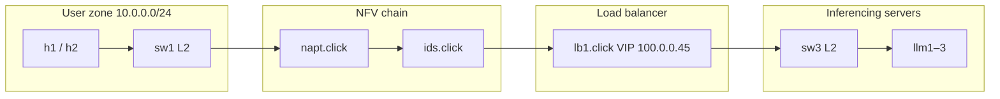
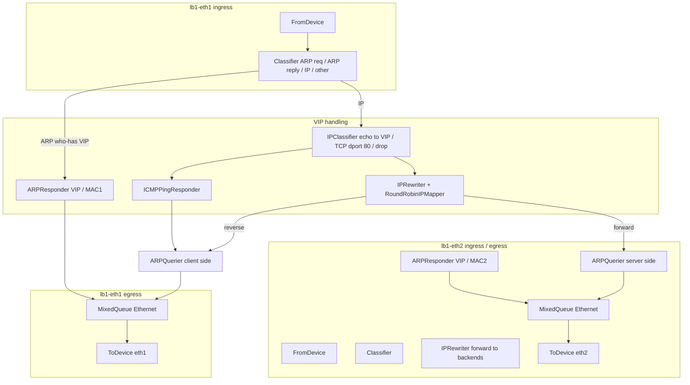

# Load balancer (`lb1`) — design, mocks, and testing

**Doc index:** see [docs/README.md](README.md) for subsystem overview and links to NAPT/IDS/topology docs.

This document explains the **Click load balancer** for IK2221 Phase 1, how it sits **between IDS and `sw3`**, and how to run **LB-only** tests (no NAPT/IDS on path) on the course VM. It focuses on **VIP semantics**, **Click elements**, and **interface/MAC alignment**. The full topology uses real NAPT and IDS **`.click`** modules in `applications/nfv/`; the LB-only test harness uses a reduced topology so you can debug **`lb1.click`** in isolation.

## References (upstream)

- [IPRewriter](https://github.com/kohler/click/wiki/IPRewriter) — TCP/UDP 4-tuple rewrite + mapping table (forward and reverse).
- [RoundRobinIPMapper](https://github.com/kohler/click/wiki/RoundRobinIPMapper) — round-robin choice of rewrite patterns for new flows.
- [ARPResponder](https://github.com/kohler/click/wiki/ARPResponder) — answer ARP queries for configured IP/MAC pairs.
- [ARPQuerier](https://github.com/kohler/click/wiki/ARPQuerier) — encapsulate outbound IP in Ethernet using ARP (`AddressInfo` shorthand).
- [ICMPPingResponder](https://github.com/kohler/click/wiki/ICMPPingResponder) — answer ICMP echo requests in software.
- [MixedQueue](https://github.com/kohler/click/wiki/MixedQueue) — like [Queue](https://github.com/kohler/click/wiki/Queue), it extends `SimpleQueue` / `NotifierQueue` in Click: **push** on inputs, **pull** on the main output (see *Processing* in `click-elem2man` / source `processing() → "h/lh"`). Use it to multiplex toward **`ToDevice`** (pull), not **upstream** of [`ARPQuerier`](https://github.com/kohler/click/wiki/ARPQuerier) (inputs are **push**; wiki: *Processing: push*). Fan multiple IP sources into one `ARPQuerier` like `napt.click`.
- POX `forwarding.l2_learning.LearningSwitch` — OpenFlow learning switches (`sw1`–`sw3`).

## Role in the full project



- **Full topology** — NAPT and IDS are Click modules on their own switches; **`lb1.click`** terminates the **virtual service IP** and round-robins HTTP to backends.
- **LB-only runs** — `topology_test_lb.py` / `make test-lb` drop NAPT/IDS so you can validate **VIP + IPRewriter + ARP/ICMP** without the rest of the chain. Keep **interface names** (`lb1-eth*`) aligned with Mininet port order.

## LB placement and Linux interfaces

| Click device | Faces | Notes |
|--------------|--------|--------|
| `lb1-eth1` | IDS / client direction | ARP + IP toward VIP enter here. |
| `lb1-eth2` | `sw3` / backends | Rewritten packets to `100.0.0.40–42` exit here; return traffic re-enters here. |

**Important:** Click’s `ARPResponder` advertises a **fixed Ethernet MAC** for the VIP. Linux must use the **same** MAC on `lb1-eth1` and `lb1-eth2` so the kernel accepts unicasts. `startup_services(net)` in `topology/topology.py` sets:

- `lb1-eth1` → `02:00:00:00:01:45`
- `lb1-eth2` → `02:00:00:00:02:45`

These match the `AddressInfo` / `ARPResponder` definitions in `applications/nfv/lb1.click`.

## Internal packet flow (conceptual)



## Click graph highlights (`lb1.click`)

1. **Ethernet classification** — `Classifier(12/0806 20/0001, …)` splits ARP requests, ARP replies, IPv4, and **drops** non-IP/non-ARP (per LB scope).
2. **ARP for VIP** — `ARPResponder(100.0.0.45/32 …)` on each side answers “who-has 100.0.0.45?” with the correct per-interface MAC.
3. **TCP to VIP:80** — `IPRewriter(RoundRobinIPMapper(…), pass 1)`:
   - For **every input port**, Click first looks up the packet in the **mapping table**; only if there is no mapping does it apply that port’s `INPUTSPEC` (`rr` on input 0, `pass 1` on input 1).
   - **Input 0** — new client→VIP flows: `RoundRobinIPMapper` installs mappings; **forward** packets leave **output 0** toward backends; **reverse** packets leave **output 1** toward clients.
   - **Input 1** — server→client return traffic: should **hit an existing mapping** and be rewritten back to the VIP without using `pass 1` in the common case.
4. **ICMP echo to VIP** — `ICMPPingResponder` synthesizes replies; output is **IP**, so it shares **`ARPQuerier(lb1_client)`** input 0 with TCP return traffic—**direct fan-in** (same pattern as `napt.click`), not a queue in front of `ARPQuerier`. A `MixedQueue`/`Queue` in that position would present a **pull** output to a **push** `ARPQuerier` input (see upstream *Processing* for each element; swapping `MixedQueue` for `Queue` does not change that, because both use the same `SimpleQueue` I/O model).
5. **Ethernet fan-in before `ToDevice`** — another **`MixedQueue`** merges **ARPResponder** output and **`ARPQuerier`** output toward the same interface.
6. **Counters / report** — `AverageCounter` + `Counter` track drops and traffic classes; `DriverManager` prints a summary when Click exits. **Stdout/stderr** paths are chosen by `click_wrapper.start_click` from `baseController.py` (`IK2221_LB_REPORT`).

## Mocking strategy (NAPT / IDS)

| File | Role while you work on LB | Production behavior |
|------|---------------------------|------------------------|
| `applications/nfv/napt.click` | **Stub L2 bridge** between `sw1` and `sw2` | NAPT + ICMP echo rewriter + ARP |
| `applications/nfv/ids.click` | **Stub two-port bridge** (`ids-eth1` ↔ `ids-eth3`) | Three-port IDS + HTTP policy + `insp` sink |
| `applications/nfv/lb1.click` | **Full LB graph** (this deliverable) | Same |

**LB-only topology** — `topology/topology_test_lb.py` builds **`LbOnlyTopo`**: one host `hc` on `100.0.0.0/24`, `sw0` (DPID 1), `lb1` (DPID 6), `sw3` (DPID 3), and the three LLM hosts. **No `napt` / `ids` switches** → POX never launches those Click binaries; only learning switches + LB run.

## Testing plan

| # | Goal | Where | Pass criteria |
|---|------|--------|-----------------|
| 1 | Syntax / static check | VM: `click-check applications/nfv/lb1.click` | No errors |
| 2 | LB-only ping VIP | `make test-lb` or manual two-terminal run | `ping -c1 100.0.0.45` from `hc` succeeds |
| 3 | HTTP GET `/index.html` | `topology_test_lb.py` | Body contains `index from llm` |
| 4 | Round-robin | nine sequential GETs | At least **two** distinct `llm*` strings in bodies (aim for all three) |
| 5 | Full chain (later) | `topology/topology_test.py` with real `napt`/`ids` | POST/PUT/IDS policy + VIP through NAPT |

### Commands

**Automated (preferred on VM)**

```bash
make test-lb
# writes lb1.report when IK2221_LB_REPORT unset defaults via baseController to /tmp/lb1.report — export to project root:
IK2221_LB_REPORT="$PWD/lb1.report" make test-lb
```

**Manual two-terminal**

```bash
# Terminal A
sudo make app

# Terminal B
sudo -E env IK2221_LB_REPORT="$PWD/lb1.report" PYTHONPATH="$PWD" \
  python3 topology/topology_test_lb.py
```

## Makefile targets (related)

| Target | Purpose |
|--------|---------|
| `make app` | Copy `applications/controller/*` and `applications/nfv/*.click` into `$(poxdir)ext/`, start POX `baseController`. |
| `make test-lb` | `POXDIR=$(poxdir)` → `scripts/run_lb_integration_test.sh` (POX + LB-only Mininet + tests). |
| `make clean` | Remove copied files, kill POX/Click, `mn -c`. |

## Troubleshooting

- **`click-check` errors on `IPClassifier` lines** — grammar differs slightly between Click builds; adjust `icmp type echo` / `tcp dst port 80` per your VM’s `click-elem2man IPClassifier` output.
- **No ARP for VIP** — confirm `startup_services` ran **after** `net.start()` and that `ip link set … address …` succeeded (run `ip link show lb1-eth1` on the VM).
- **TCP works but ICMP does not** — verify `ICMPPingResponder` second output is wired to `Discard` and that `CheckIPHeader` accepts echo requests toward `100.0.0.45`.
- **`MixedQueue` drops** — if the queue is too small under load, raise capacity in `lb1.click`.

## Suggested next steps (hand-in path)

1. Replace **`napt.click`** / **`ids.click`** mocks with real NFVs; add **`ids-eth2`** toward `insp` in topology + Click.
2. Extend **`topology_test.py`** for full policy (HTTP methods, injection strings, `phase_1_report`).
3. Align tarball layout with Canvas (`results/` vs `topology/` tests).

---

*Diagrams use [Mermaid](https://mermaid.js.org/) syntax compatible with GitHub and many Markdown previewers.*
