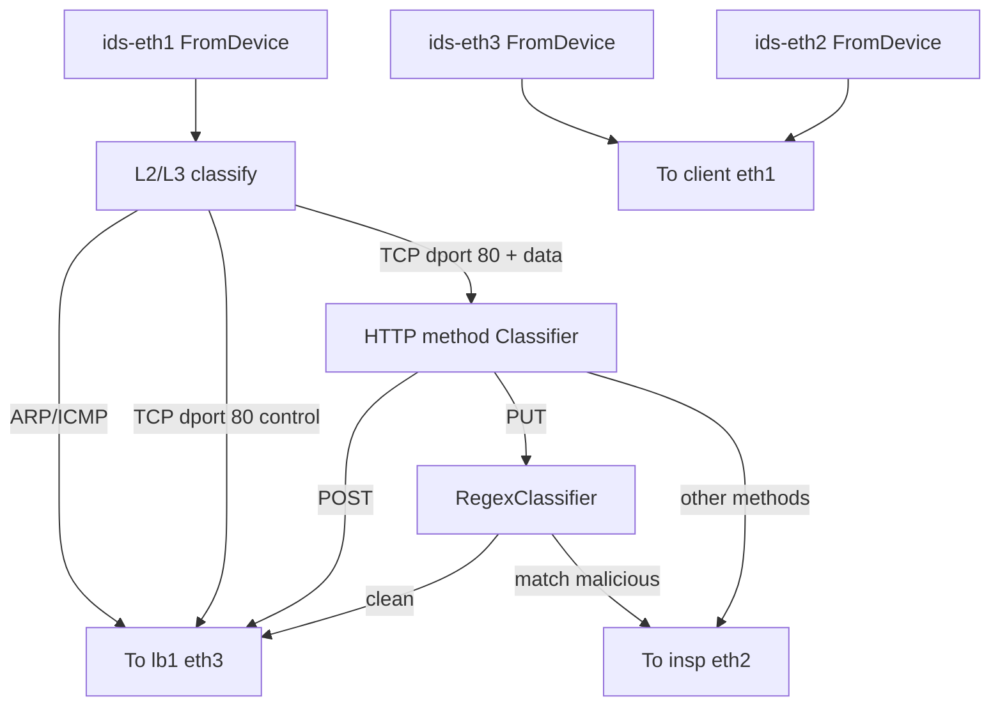

# NFV: IDS (`ids.click`)

The **IDS** is a **transparent bump** between the access side (`sw2` / NAPT direction) and the **load balancer**, with a third leg to **`insp`** for **suspicious** HTTP. It has **no IP address**; it forwards L2 frames after classification.

## Three ports

| Define | Interface | Direction in topology |
|--------|-----------|------------------------|
| `$PORT1` | `ids-eth1` | Toward **clients** / `sw2` (policy ingress) |
| `$PORT2` | `ids-eth2` | Toward **`insp`** (sink for blocked / malicious) |
| `$PORT3` | `ids-eth3` | Toward **`lb1`** (allowed and transparent pass-through) |

Return traffic from **`lb1`** (`fd3`) and any traffic from **`insp`** (`fd2`) is merged back toward clients via `q1` → `td1`.

## Policy summary (brief alignment)

- **ARP** and **ICMP** from the client-facing port: **pass** to `lb1` (`q3`), not inspected as HTTP.
- **TCP to destination port 80** with payload: interpret **HTTP method** at a **fixed offset** in the packet (after assumed Ethernet + IP + TCP headers)—**`POST`** allowed to `lb1`; **`PUT`** goes through **payload** checks.
- **TCP signaling** (SYN/FIN/RST/ACK without payload): **pass** toward `lb1` (so connections can establish).
- **TCP source port 80**: responses — **pass** toward `lb1`.
- **Other TCP**: wired to pass per current graph (non–dst-80 traffic).
- **Disallowed HTTP methods** (anything other than the allowed branches): **send to `insp`** (`q2`).
- **`PUT` with injection-like payload**: regex matches → **`insp`**; clean `PUT` → **`lb1`**.

### Regex / payload dependency

The file documents use of **`RegexClassifier`**, which requires **PCRE-enabled Click** (expected on the IK2221 VM). If your build lacks PCRE, rebuild Click with `--enable-pcre`.

The brief suggests advancing the payload pointer with **`Search`** for efficiency; this implementation uses **`RegexClassifier`** over patterns (implementation choice—know the tradeoff for oral exam).

## Data-path sketch

## Counters and report

`AverageCounter` on each `FromDevice` ingress; `Counter` elements label drops, ARP, ICMP, TCP signaling, method branches, malicious vs clean PUT; **`DriverManager`** prints an **`ids.report`**-style summary on teardown (via stdout redirection to `IK2221_IDS_REPORT`).

## Key file

- `applications/nfv/ids.click`

See also: [topology-and-testing.md](topology-and-testing.md) (PCAP path on `insp`), [nfv-load-balancer.md](load_balancer.md).
