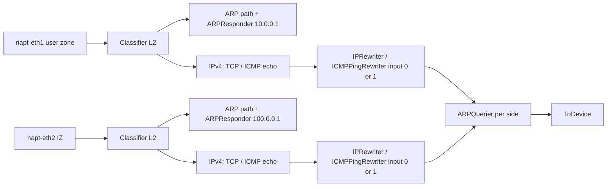

# NFV: NAPT (`napt.click`)

The **NAPT** terminates the boundary between the **User Zone** (`10.0.0.0/24`) and the **Inferencing Zone** (`100.0.0.0/24`). Course brief: user hosts must not expose private addresses into `100.0.0.0/24`; the NAPT presents **`10.0.0.1`** and **`100.0.0.1`** on its two sides.

## Interfaces (Mininet / Click)

| Macro | Linux iface | Logical IP | MAC (configured in Click) |
|-------|-------------|------------|---------------------------|
| `$USER_IF` | `napt-eth1` | `10.0.0.1` | `02:aa:00:00:00:01` |
| `$INF_IF` | `napt-eth2` | `100.0.0.1` | `02:aa:00:00:00:02` |

Ingress uses `FromDevice(..., SNIFFER false, PROMISC true)` so Click **owns** the frames (per brief / Click notes on stealing).

## High-level pipeline

1. **AverageCounter** immediately after each `FromDevice` and before each `ToDevice` (brief-style instrumentation).
2. **L2 classifier**: ARP vs IPv4; other Ethernet types dropped (counter).
3. **ARP**: opcode split (request vs reply); **ARPResponder** answers who-has for the side’s gateway IP; replies feed **ARPQuerier** caches.
4. **IPv4**: `CheckIPHeader` then **IPClassifier** for TCP vs ICMP echo request/reply vs other (drop).
5. **TCP**: **`IPRewriter`** with **`IPRewriterPatterns`**—new flows from user zone get source rewritten toward `100.0.0.0/24` semantics; reverse path restores `10.0.0.0/24` view for returning packets.
6. **ICMP echo**: **`ICMPPingRewriter`** with parallel pattern naming; identifier behaves like a “port” for mapping.
7. **Merge**: **PrioSched** prioritizes ARP queues over IP queues to reduce ARP starvation under load.

## Counters and report

- **Per-class `Counter` elements**: user/inf ARP handling, TCP translated each direction, ICMP translated each direction, drops for non-handled traffic.
- **`DriverManager`**: on pause/stop, prints a **“=== NAPT Report ===”** block (rates and counts from `AverageCounter`/`Counter`).

**Note:** Click’s stdout is redirected by `click_wrapper` to `IK2221_NAPT_REPORT`, so those `print` lines from `DriverManager` are what graders collect as **`napt.report`**.

## Relation to topology

Hosts `h1`/`h2` use **`defaultRoute='via 10.0.0.1'`**, matching the NAPT user-side logical address. IZ hosts route via **`100.0.0.1`** or the VIP as required by the assignment figure.

## Key file

- `applications/nfv/napt.click`

See also: [controller-and-click-wrapper.md](controller-and-click-wrapper.md), [topology-and-testing.md](topology-and-testing.md).
