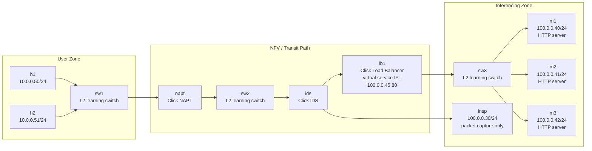
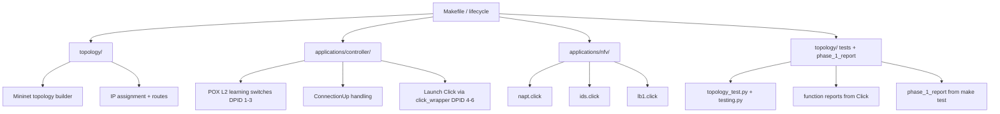
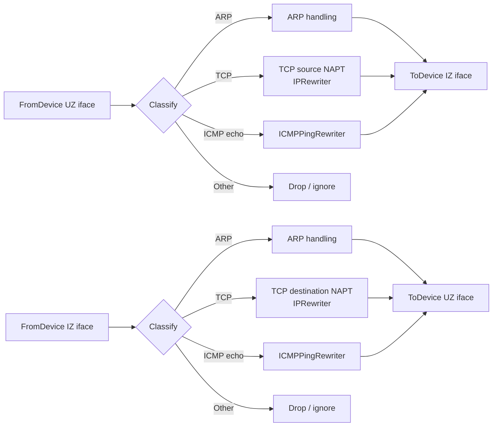
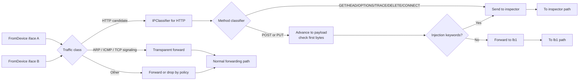
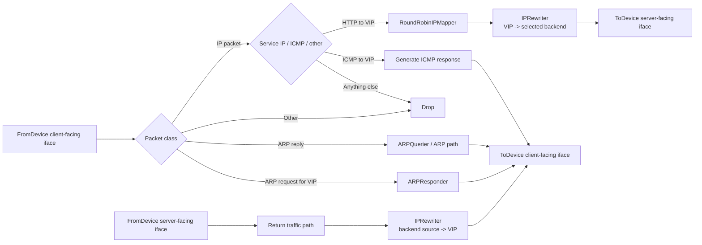
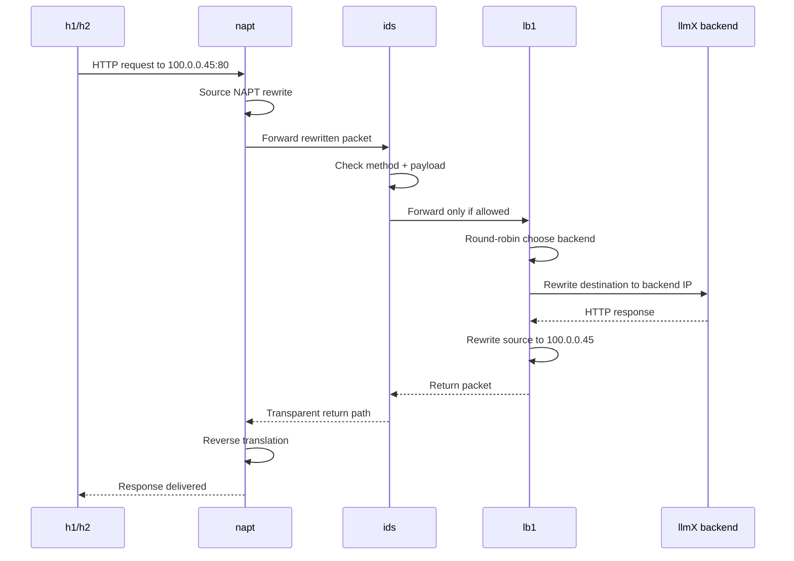
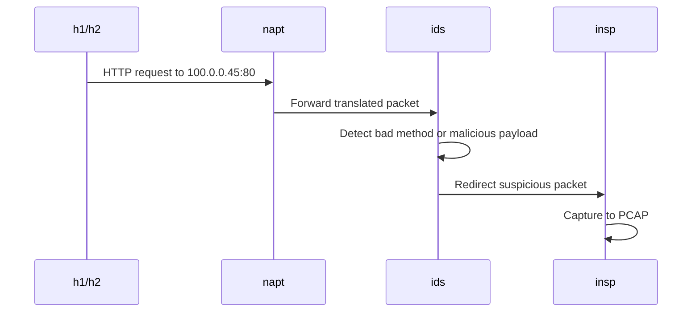
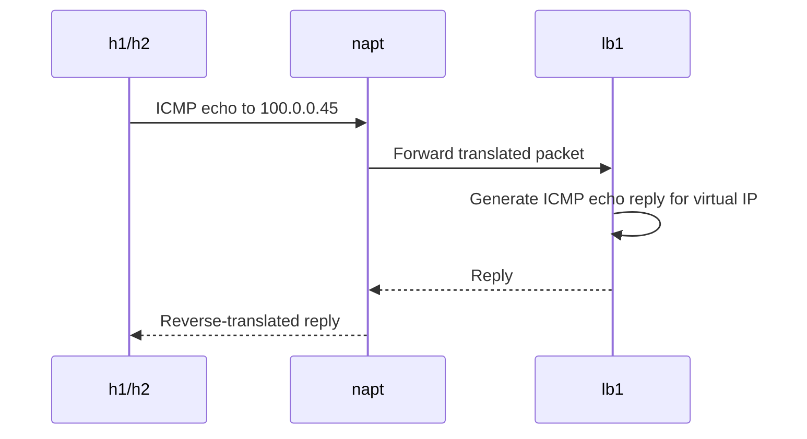
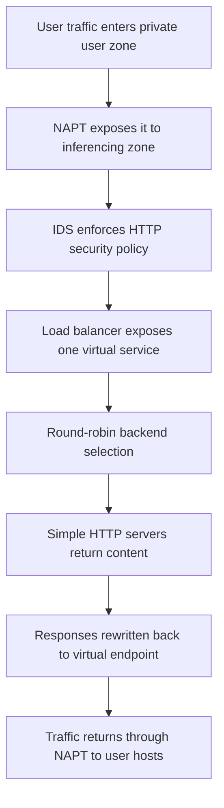

# IK2221 Phase 1 - Final System Architecture

## Purpose of this document

This document synthesizes the **final system architecture** implied by the project brief. It is written to help you understand:

1. the **major components** of the project,
2. the **responsibility of each component**,
3. the **interfaces between components**, and
4. how the whole system is expected to execute end-to-end.

> Important note:
> The project brief defines the **network topology, runtime behavior, and folder structure**, but it does **not** prescribe a full software API design. So the architecture below is a **clean implementation architecture derived from the brief**, not a claim that the PDF literally gives these exact class names or software interfaces.

Section **#0** below grounds this plan in the **provided skeleton** (paths, Makefile, POX hooks, DPID mapping). Earlier sections still describe required **network behavior**; use section 0 when translating the design into this repo’s files.

---

# 0. Skeleton code alignment (this repository)

The distributed **project skeleton** fixes concrete filenames, POX integration, and DPID assumptions. The layering in sections 1–12 remains valid as behavioral guidance; this section maps it to what the skeleton **actually contains** so implementation stays consistent with the code you must extend.

## 0.1 Directory layout (as provided)

| Area | Path in repo | Role |
|------|----------------|------|
| Mininet topology + CLI entry | `topology/topology.py` | Defines `MyTopo`, starts `RemoteController` at `127.0.0.1:6633`, calls `startup_services(net)` (currently a stub you must complete for HTTP servers, inspector capture, routes). |
| Automated test driver | `topology/topology_test.py` | Builds the same topology, starts the network, runs `run_tests(net)` after `startup_services(net)`. Extension point for automated scenarios; imports `from topology import *`. |
| Test helpers | `topology/testing.py` | Stubs for `ping()` / `curl()`; assertions and timeouts are TODOs. |
| POX controller + Click launcher | `applications/controller/baseController.py` | Registers OpenFlow listeners; attaches `LearningSwitch` from `forwarding.l2_learning` for DPIDs **1–3**; launches Click for **4** (`napt`), **5** (`ids`), **6** (`lb1`) via `applications/controller/click_wrapper.py`. |
| Click process wrapper | `applications/controller/click_wrapper.py` | Shells out with `sudo click …`, redirects stdout/stderr to `/tmp/*.stdout` / `*.stderr`, tracks PIDs, `killall click` on shutdown paths. |
| Click NFV sources | `applications/nfv/*.click` | `napt.click`, `ids.click`, `lb1.click` are symmetric **L2 forwarder** stubs (`FromDevice` → `Counter` → `Queue` → `ToDevice`). `forwarder.click` is an older sample referencing `sw1-eth*`. |
| Lifecycle | `Makefile` | `topo`: `sudo python ./topology/topology.py`. `app`: `cp applications/controller/* $(poxdir)ext/`, `cp applications/nfv/*.click $(poxdir)ext/`, then `sudo python /opt/pox/pox.py baseController` (override `poxdir` for non-default installs). `clean`: removes copied files from `$(poxdir)ext/`, kills POX, `mn -c`, `killall click`. **`test` is a stub** in the skeleton and must be completed per the brief (`make test` → topology + controller + tester + `phase_1_report`). |

**Course brief vs skeleton packaging:** Phase 1 text describes a hand-in tarball with paths such as `application/controllers/`, a top-level `nfv/`, and `results/` for tests. The **skeleton** consolidates controller + Click under **`applications/`** and keeps the Python test harness next to the topology under **`topology/`**. Before submission, follow the **current** Canvas folder checklist; functionally, keep the Makefile’s copy targets aligned with where POX loads `baseController` and the `.click` files (`$(poxdir)ext/` by default).

## 0.2 POX + Click wiring (`baseController.py`)

- **Learning vs NFV** is decided only by numeric **DPID**: `id <= 3` → `LearningSwitch(event.connection, False)`; `4` / `5` / `6` → `click_wrapper.start_click("/opt/pox/ext/napt.click", …)` etc. (paths assume default `poxdir=/opt/pox/` after `make app`).
- Your Mininet `addSwitch(..., dpid="N")` scheme must stay consistent with this mapping whenever you rename switches or reorder devices.
- Replace the bodies of **`applications/nfv/napt.click`**, **`ids.click`**, **`lb1.click`** in-repo; `make app` copies them into POX `ext/` for runtime.

## 0.3 Click interface names in the stubs (`FromDevice` / `ToDevice`)

Mininet derives Linux interface names from the node name plus port index. The skeleton uses:

| Module | `define(...)` ports | Notes |
|--------|---------------------|--------|
| `napt.click` | `napt-eth1`, `napt-eth2` | Bidirectional bridge today; real NAPT must still terminate on these two device names unless you change link order and update defines together. |
| `ids.click` | `ids-eth1`, `ids-eth3` | Second attachment is intentionally **`eth3`** in the file (third port index)—keep defines synchronized with actual `ids-eth*` after topology edits. |
| `lb1.click` | `lb1-eth1`, `lb1-eth2` | Client/IDS-facing vs server-side toward `sw3`/LLM cluster. |

The PDF requires **`SNIFFER false`** on `FromDevice` to avoid duplicate kernel forwarding; the stubs already set `SNIFFER false, PROMISC true`.

## 0.4 Topology skeleton vs Figure 1

`topology/topology.py` uses **`s1`–`s3`** as switch names while the brief and diagrams use **`sw1`–`sw3`**; several IZ hosts still show **`10.0.0.x` addresses with TODOs** instead of the **`100.0.0.x`** plan (and `insp` should be **`100.0.0.30/24`** per Figure 1). Treat the file as **structure + DPID template**: align **names, subnets, default routes** (e.g. `h1`/`h2` via **`10.0.0.1`**) with the PDF **without breaking** the `1–3` learning / `4–6` NFV split expected by `baseController.py`.

## 0.5 Missing pieces you must implement (brief + skeleton gaps)

- **`startup_services(net)`** in `topology/topology.py`: start **`python3 -m http.server 80`** (or equivalent) on **`llm1`–`llm3`**, start **`tcpdump`** (or equivalent) on **`insp`** for PCAP evidence, set **default routes** on hosts as needed (PDF suggests `ip route add default via 10.0.0.1` from the user zone).
- **`Makefile` `test`**: must chain **`topo` + `app` + automated tests** and capture stdout/stderr into **`phase_1_report`** (fully automatic, per PDF).
- **Reports**: each NFV should emit **`<function_id>.report`** on teardown using **`AverageCounter`/`Counter`** placement per the PDF’s testing section (example table for `lb1.report`).

---

# 1. Executive summary

The final system should be understood as a **layered NFV system** running in a Mininet-based emulated network.

At a high level:

- **Mininet** creates the topology and hosts/switches.
- **POX** acts as the control-plane orchestrator.
- **OpenFlow/OVS learning switches** provide normal L2 forwarding for `sw1`, `sw2`, and `sw3`.
- **Click modules** implement the three required network functions:
  - `napt`
  - `ids`
  - `lb1`
- **Simple HTTP servers** on `llm1`, `llm2`, `llm3` emulate the inferencing backends.
- **Inspector host (`insp`)** passively receives suspicious traffic redirected by the IDS.
- **Automated tests + reports** verify correctness and collect counters.

So the architecture is best seen as a split between:

- **Topology / infrastructure layer**
- **Control plane**
- **Data-plane NFV services**
- **Application endpoints**
- **Testing / observability / packaging**

---

# 2. Top-level architecture



---

# 3. Architectural layers

## 3.1 Infrastructure / topology layer

This layer is responsible for **creating the emulated network**.

### Responsibilities

- Instantiate the topology in Mininet.
- Create hosts, switches, and links with the required names.
- Enforce the IP plan from Figure 1.
- Ensure switch naming remains sequential (`sw1`, `sw2`, `sw3`) so DPID mapping stays predictable.
- Provide default routes for hosts where needed.

### Main components

- `topology/topology.py` (and any additional topology modules you add under `topology/`)
- Mininet host definitions
- Mininet switch definitions
- link configuration
- IP addressing and default gateways
- `startup_services(net)` for host-side daemons (HTTP, `tcpdump` on `insp`, routing helpers)

### Output of this layer

A fully booted emulated network containing:

- `h1`, `h2`
- `sw1`, `sw2`, `sw3`
- `napt`, `ids`, `lb1`
- `llm1`, `llm2`, `llm3`
- `insp`

---

## 3.2 Control plane

This layer is responsible for **orchestrating forwarding behavior and starting the NFV modules**.

### Responsibilities

- Run a centralized **POX controller**.
- Treat `sw1`, `sw2`, `sw3` as standard OpenFlow L2 learning switches.
- Observe Mininet node registrations.
- When `napt`, `ids`, or `lb1` appear, start the corresponding **Click module**.
- Keep the topology and NFV runtime wired together.

### What this layer is *not*

The POX controller is **not** where the NAPT/IDS/LB packet-processing logic should live.
That logic belongs in Click modules.

### Main components

- `applications/controller/baseController.py` (class `controller`, `launch()` registers it with POX)
- `applications/controller/click_wrapper.py` (`start_click`, teardown helpers)
- POX L2 learning (`forwarding.l2_learning.LearningSwitch`) for the three OpenFlow switches with **DPID 1–3** (named `sw1`–`sw3` in the brief; align skeleton `s1`–`s3` naming with submission requirements)
- Subprocess launch of Click modules for **DPID 4–6** (`napt`, `ids`, `lb1`)

---

## 3.3 Data-plane NFV services

This is the heart of the project.

It contains the three required network functions, each implemented as a **Click module bound to a Mininet node/interface set**.

### Required modules

- `applications/nfv/napt.click`
- `applications/nfv/ids.click`
- `applications/nfv/lb1.click`

These modules are the actual packet-processing engines. At runtime, **`make app`** copies them to **`$(poxdir)ext/`** (e.g. `/opt/pox/ext/`) where `baseController.py` loads them by absolute path.

---

## 3.4 Application/service endpoint layer

These are the endpoints that make the network function pipeline meaningful.

### Components

- `llm1`, `llm2`, `llm3`
  - lightweight Python HTTP servers
  - same test pages on all servers
- `insp`
  - passive host
  - packet capture to PCAP
  - no active service logic required

### Role of the service layer

- gives the load balancer real backend targets,
- gives the IDS a sink for suspicious traffic,
- makes end-to-end testing possible.

---

## 3.5 Testing / observability / packaging layer

This layer proves that the implementation works and that it can be graded automatically.

### Responsibilities

- run automated tests,
- generate valid traffic scenarios,
- verify outcomes automatically,
- collect Click counters,
- write `<function_id>.report` files,
- produce `phase_1_report` from `make test`,
- keep the folder structure submission-compliant.

### Key files

- `topology/topology_test.py` (test orchestration entry; may spawn or assume controller/topo per your final `make test` design)
- `topology/testing.py` (shared traffic primitives)
- generated `lb1.report`, `ids.report`, `napt.report` (written by Click on teardown; location should be predictable for graders)
- generated `phase_1_report` (stdout/stderr of `make test`, per PDF)
- root `Makefile` (`topo`, `app`, `clean`, **`test` to be completed** in the skeleton)

---

# 4. Responsibilities of each major component

| Component | Type | Core responsibility | Key constraints / behavior |
|---|---|---|---|
| `h1`, `h2` | User hosts | Generate traffic toward the virtual service | Must sit behind NAPT |
| `sw1` | L2 switch | Connect user hosts to NAPT | Regular POX/OVS learning switch |
| `napt` | Click NFV module | Hide user-zone addresses and translate TCP/ICMP traffic bidirectionally | Must handle ARP, TCP translation, ICMP echo translation |
| `sw2` | L2 switch | Transit/core interconnect in inferencing zone | Regular POX/OVS learning switch |
| `ids` | Click NFV module | Transparently inspect HTTP traffic, allow only safe methods/payloads, redirect suspicious packets to inspector | Must pass ARP/ICMP/TCP signaling transparently |
| `insp` | Passive host | Receive suspicious traffic and capture PCAP proof | No service logic required |
| `lb1` | Click NFV module | Own virtual service IP `100.0.0.45:80`, answer ARP, answer ping, round-robin distribute allowed HTTP requests to backends, rewrite responses back to virtual IP | Must present the service as a single virtual endpoint |
| `sw3` | L2 switch | Connect load balancer to backend cluster | Regular POX/OVS learning switch |
| `llm1-3` | Backend servers | Serve simple HTTP content as inference stand-ins | Same lightweight pages on all servers |
| POX controller | Control plane | On each `ConnectionUp`, classify by **DPID** and either attach `LearningSwitch` or `start_click` for NFV nodes | Skeleton: **no** NFV logic inside POX beyond launching Click |
| Test harness | Validation | `topology/topology_test.py` + `topology/testing.py` | Skeleton returns `True` from helpers; must assert real outcomes for grading |
| Makefile | Lifecycle interface | `topo`, `app`, `clean`, `test` + **`phase_1_report`** | Skeleton `test` target is incomplete |

---

# 5. Clean interface model between components

The brief is written mostly in networking terms, not software-interface terms. A clean way to think about the interfaces is the following.

## 5.1 Infrastructure-to-control interface

### Interface
- **OpenFlow `ConnectionUp` events** (one per switch datapath that connects to POX)

### Producer
- Mininet + OVS switches (`OVSSwitch`) with configured DPIDs

### Consumer
- `applications/controller/baseController.py`

### Meaning
When each switch joins the controller, the skeleton uses **`event.dpid`** to decide whether to attach **`LearningSwitch`** (DPIDs **1–3**) or to **`start_click`** for **`napt` / `ids` / `lb1`** (**4 / 5 / 6**). This is stricter than a generic “node name” registry: **DPID assignment in `topology.py` must stay in lockstep** with that `if/elif` ladder (or you must update both together).

---

## 5.2 Control-to-switch interface

### Interface
- **OpenFlow 1.0 control messages**

### Producer
- POX controller

### Consumer
- `sw1`, `sw2`, `sw3`

### Meaning
Standard L2 switching behavior is enforced here.

---

## 5.3 Control-to-NFV interface

### Interface
- **process launch / module startup**

### Producer
- POX controller (`click_wrapper.start_click`, which uses `subprocess.Popen` with `shell=True`)

### Consumer
- Click runtime for `napt`, `ids`, `lb1`

### Meaning
After **`make app`**, the `.click` files live under **`$(poxdir)ext/`** (default `/opt/pox/ext/`). `baseController.py` launches **`/opt/pox/ext/napt.click`** (and similarly for `ids`/`lb1`) when the corresponding **DPID** connects. Edit sources under **`applications/nfv/`** in git; rely on the Makefile copy step for POX to see changes.

---

## 5.4 NFV packet interfaces

### Interface
- **raw packets on Mininet interfaces**

### Producer / Consumer
- Click `FromDevice` / `ToDevice`

### Meaning
This is the real data-plane interface. Each NFV module reads packets from device interfaces, transforms or classifies them, then emits packets back out.

---

## 5.5 IDS-to-inspector interface

### Interface
- **redirected suspicious packets**

### Producer
- IDS module

### Consumer
- `insp`

### Meaning
Suspicious HTTP requests do not continue toward `lb1`; they are forwarded to the inspector path and captured.

---

## 5.6 LB-to-backend interface

### Interface
- **rewritten server-bound HTTP traffic**

### Producer
- `lb1`

### Consumer
- `llm1`, `llm2`, `llm3`

### Meaning
The load balancer translates the virtual destination IP into one concrete backend IP chosen by round robin.

---

## 5.7 Reporting interface

### Interface
- **counter report files**

### Producer
- Click modules on teardown

### Consumer
- tests / graders / humans

### Meaning
Each NFV function emits a machine-readable or at least structured report file such as `lb1.report`.

---

# 6. Recommended software decomposition

A strong project structure would map the architecture into five implementation sections.



## Suggested ownership by folder

### `topology/`
Owns:
- Mininet node creation
- links
- IP plan
- routes
- `startup_services(net)` (HTTP on LLMs, `tcpdump` on `insp`, routing)
- **`topology_test.py` / `testing.py`** in the skeleton (PDF tarball layout may instead use a separate `results/` directory—mirror whatever Canvas mandates)

### `applications/controller/`
Owns:
- POX `baseController.py` entry (`pox.py baseController`)
- learning-switch behavior for the three switches with **DPID 1–3**
- branching on **DPID 4/5/6** to launch `napt` / `ids` / `lb1` Click via `click_wrapper`

### `applications/nfv/`
Owns:
- packet-processing logic
- ARP handling
- rewrites
- classifiers
- counters
- per-module reports

### Tests and evidence (skeleton: under `topology/`)
Owns:
- automated traffic scenarios
- assertions
- result collection orchestration
- coordination with **`make test`** and **`phase_1_report`**

---

## Phase 1 work breakdown (five-way)

The following is merged from the team document **`IK2221_Phase1_Work_Breakdown.docx`** (local copy may live under `Downloads/`). **Confirm the submission deadline on Canvas** if it differs.

**Deadline (from doc):** April 29, 2026 at 17:00.

### Overview

Deliver three Click modules (**NAPT**, **IDS**, **load balancer**), a correct Mininet topology, automated tests, and per-function **`.report`** files plus **`phase_1_report`**.

### Status snapshot

**Already in place (skeleton + partial updates)**

- Switches, hosts, links, IPs in `topology/topology.py` (iterate until Figure 1 matches)
- Controller wiring: `applications/controller/baseController.py`, `applications/controller/click_wrapper.py`
- HTTP servers on `llm1`–`llm3`, `tcpdump` on inspector (`startup_services`)
- Basic test scaffolding: `topology/topology_test.py`, `topology/testing.py`

**Still to build**

- Real **`napt.click`** — address/port translation
- Real **`ids.click`** — HTTP inspection and redirect to `insp`
- Real **`lb1.click`** — VIP, round-robin, rewrites, ICMP to VIP
- Full automated test suite and strict pass/fail assertions
- **AverageCounter** / **Counter** placement and **DriverManager** → **`napt.report`**, **`ids.report`**, **`lb1.report`**
- **`Makefile`** `test` rule and fully generated **`phase_1_report`**

### Person 1 — Topology, hosts, and test framework

**Status:** mostly scaffolding done; expand and harden.

**Done / started**

- IPs and default gateways for `h1`, `h2`, `insp`, `llm1`–`llm3` in `topology.py`
- `startup_services(net)` — HTTP on LLMs, `tcpdump` on inspector
- `ping()` / `curl()` in `testing.py` with pass/fail logic (verify return values propagate correctly)
- Initial cases in `topology_test.py`

**Remaining**

- Ensure helpers return **`passed`** (not a stub `True`) everywhere assertions matter
- Ensure **`startup_services(net)`** runs only after **`net.start()`** in every entry path (`topology_test.py`, `Makefile` flow, etc.)
- Expand **`topology_test.py`**: all relevant HTTP methods, injection payloads, round-robin checks
- Add **`index.html`** (or equivalent) in the LLM web root so bare **`curl`** to `/` returns content
- Wire / complete **`make test`** in the root **`Makefile`**

**Test cases to cover (checklist)**

| Scenario | Expectation |
|-----------|----------------|
| `h1` ping `h2` | Same subnet; should succeed |
| `h1` ping `100.0.0.45` | Virtual service IP through NAPT + LB ICMP path |
| `POST` / `PUT` to `100.0.0.45:80` | IDS allows → reaches backends via LB |
| `GET`, `HEAD`, `DELETE`, `OPTIONS`, `TRACE`, `CONNECT` to VIP | IDS blocks / sends to inspector per spec |
| `PUT` with injection payloads | Substrings such as `cat /etc/passwd`, `cat /var/log/`, `INSERT`, `UPDATE`, `DELETE` → inspector path |
| Round-robin | Several requests; observe different backends handling load |

### Person 2 — NAPT (`napt.click`)

**Goal:** Translate between **`10.0.0.0/24`** (user zone) and **`100.0.0.0/24`** (inferencing zone) for the traffic classes required in the brief.

**Interfaces (naming)**

- **`napt-eth1`** — user side, logical **`10.0.0.1`**
- **`napt-eth2`** — inferencing side, logical **`100.0.0.1`**

**Implementation outline**

1. **FromDevice** / **ToDevice** on both interfaces (extend skeleton).
2. **Classifier** on each side — e.g. Ethernet type at offset 12: ARP (`0806`), IPv4 (`0800`), else other.
3. **ARP** — **ARPResponder** per side for that interface’s IP; tie **ARPQuerier** so outbound IP gets correct Ethernet headers.
4. **TCP** — **IPRewriter** with patterns for outbound (e.g. user hosts → `100.0.0.1` ephemeral range) and reverse inbound.
5. **ICMP echo** — **ICMPPingRewriter** for request/reply across subnets.
6. **Drop** non-ARP / non-TCP / non-ICMP-echo as allowed by the brief.
7. **Metrics** — **AverageCounter** immediately after each **FromDevice** and before each **ToDevice**; **Counter** per traffic class.
8. **DriverManager** — on shutdown, print counters to **`napt.report`**.

**Key Click elements:** Classifier, ARPResponder, ARPQuerier, IPRewriter, ICMPPingRewriter.

### Person 3 — Load balancer (`lb1.click`)

**Goal:** Expose virtual service **`100.0.0.45:80`**, round-robin to **`llm1`** (`100.0.0.40`), **`llm2`** (`.41`), **`llm3`** (`.42`), and answer **ping** to the VIP.

**Interfaces**

- **`lb1-eth1`** — toward clients (IDS side)
- **`lb1-eth2`** — toward **`sw3`** / servers

**Implementation outline**

1. Per-interface classification — ARP request vs ARP reply vs IPv4 vs other (doc used patterns such as `Classifier(12/0806 20/0001, 12/0806 20/0002, 12/0800, -)`; align with your exact framing).
2. **ARP requests** for VIP — **ARPResponder** with a chosen virtual MAC (example from doc: `02:00:00:00:00:45`).
3. **ARP replies** — into **ARPQuerier** elements (one per interface).
4. **IP toward servers (`eth1`)** — if dest IP ≠ VIP, drop; if ICMP, answer echo per spec; if TCP `:80`, **IPRewriter** + **RoundRobinIPMapper** across the three backends.
5. **IP toward clients (`eth2`)** — same rewriter reverses source addresses to **`100.0.0.45`**.
6. Discard non-ARP / non-IP where required.
7. Counters — ARP req/reply, service traffic, ICMP, drops (see project Table 1).
8. **DriverManager** → **`lb1.report`** (rates, totals per class).

### Person 4 — IDS (`ids.click`)

**Goal:** Transparent bridge; inspect **HTTP**; allow only **POST** and safe **PUT**; suspicious traffic to **`insp`**.

**Interfaces (three-port)**

- **`ids-eth1`** — toward **`sw2`** (from NAPT / user direction)
- **`ids-eth3`** — toward **`lb1`**
- **`ids-eth2`** — toward **`insp`** (inspector)

**Implementation outline**

1. From **`eth1`**, classify: ARP, ICMP, TCP control, HTTP (TCP 80 with payload), other (**IPClassifier** and related elements).
2. **Transparent pass-through:** ARP, ICMP, TCP signaling — **`eth1` ↔ `eth3`** bidirectionally without payload inspection.
3. **HTTP from clients:** parse method via **Classifier** on known method spellings (hex patterns at the HTTP start — e.g. `POST` / `PUT` / `GET` / … as specified in the course material).
4. **POST** → forward to **`eth3`**.
5. **PUT** → use **Search** (or equivalent) for the HTTP header terminator **`\r\n\r\n`** (hex `0d0a0d0a`) to locate body start; **Classifier** on first body bytes for injection keywords (`cat /etc/passwd`, `cat /var/log/`, `INSERT`, `UPDATE`, `DELETE` per brief). Match → **`eth2`**; no match → **`eth3`**.
6. Other methods → **`eth2`**.
7. **Responses `eth3` → `eth1`:** forward without HTTP inspection.
8. Counters per class + **AverageCounter** placement; **DriverManager** → **`ids.report`**.

**Notes**

- Use **Classifier** / hex for keyword detection at the payload start; **Search** is for advancing the pointer, not for scanning the whole packet for each keyword.
- Treat as the **most intricate** Click graph — start early.

### Person 5 — Integration, reporting, and Makefile

**Goal:** **`make test`** runs end-to-end; every Click module emits **`.report`**; submission layout is correct.

**Tasks**

1. **`Makefile` `test`** — e.g. `make clean`, start controller in background, wait until ready, run **`topology_test.py`**, capture **stdout/stderr** to **`phase_1_report`**, tear down processes cleanly.
2. Support NFV owners with counter/report templates: **AverageCounter** after every **FromDevice** and before every **ToDevice**; **Counter** per traffic class; **DriverManager** printing to **`<function>.report`** on exit.
3. Verify report fields against the project table (rates, totals per class, drops).
4. **Tarball** naming: **`ik2221-assign-phase1-teamN.tar.gz`** with required internal layout.
5. End-to-end sweeps once all Click graphs exist.
6. Fill **`MEMBERS`** (name + KTH email per line / as Canvas specifies).

### Submission folder structure (from doc)

Use **exact** names if the autograder expects this tree; otherwise mirror **Canvas** instructions.

```text
ik2221-assign-phase1-teamN/
├── MEMBERS
├── Makefile
├── README
├── topology/              # topology.py, topology_test.py, testing.py
├── applications/
│   ├── controller/        # baseController.py, click_wrapper.py
│   └── nfv/               # napt.click, ids.click, lb1.click
└── results/               # optional: extra scripts; phase_1_report output location per Makefile
```

*This repo’s skeleton may keep tests under `topology/` instead of `results/` — align the tarball with whatever the course VM checker enforces.*

### Suggested timeline (from doc)

| When | Focus |
|------|--------|
| Now – Apr 25 | Persons 2–4 start Click; Person 5 Makefile `test` + reporting templates |
| Apr 25–27 | Click modules mostly working; Person 1 expands tests; Person 5 integration |
| Apr 27–28 | Full `make test`, bugfixes, verify all **`.report`** files |
| Apr 28–29 | Cleanup, **MEMBERS**, tarball, submit before **17:00** |

### Important reminders (from doc)

- **Individual evaluation:** every member must be able to explain any subsystem in discussion.
- **Naming and layout** matter for automated grading.
- **No exotic Python packages** — stick to the course VM.
- **Plagiarism** checks apply to submissions.

### Condensed three-person variant (optional)

If the team has only three contributors, merge roles as follows:

| Combined role | Takes doc roles |
|----------------|-----------------|
| **A — Infra + control + tests** | Person 1 + parts of Person 5 (topology, `startup_services`, `topology_test.py` / `testing.py`, test expansion) |
| **B — NAPT** | Person 2 |
| **C — IDS + LB + integration** | Person 3 + Person 4 + remainder of Person 5 (`lb1.click`, `ids.click`, `Makefile` / `phase_1_report`, tarball, **MEMBERS**) |

---

# 7. Internal architecture of each NFV component

## 7.1 NAPT internal architecture

### Responsibility
Convert private user-zone addressing (`10.0.0.0/24`) into inferencing-zone addressing (`100.0.0.0/24`) and back again.

### Must support
- ARP handling
- TCP translation via `IPRewriter`
- ICMP echo translation via `ICMPPingRewriter`

### Internal view



### Architectural interpretation

The NAPT is fundamentally a **bidirectional edge translator**.
It is the boundary between the private user zone and the public-facing inferencing zone.

---

## 7.2 IDS internal architecture

### Responsibility
Inspect HTTP traffic while remaining transparent for basic forwarding traffic.

### Policy
- pass ARP, ICMP ping, and TCP signaling transparently,
- inspect HTTP requests,
- allow only **POST** and **PUT** methods,
- inspect the start of the HTTP payload for dangerous strings,
- send suspicious traffic to `insp`,
- forward safe traffic to `lb1`.

### Internal view



### Architectural interpretation

The IDS is a **policy enforcement choke point** placed before the load balancer.
It is not just passive monitoring; it actively decides whether a request may continue.

---

## 7.3 Load balancer internal architecture

### Responsibility
Expose a single virtual service endpoint at `100.0.0.45:80`, respond to ARP and ping for that service, and distribute allowed HTTP traffic across three backend servers.

### Required logic
- classify traffic into ARP request, ARP reply, IP packet, other,
- respond to ARP for the virtual service IP,
- answer ping to the virtual IP,
- for service traffic, use round-robin server selection,
- rewrite server-bound packets to the selected backend,
- rewrite return packets so clients always see the virtual service IP.

Implementation notes, mocked NAPT/IDS context, LB-only Mininet topology, and a step-by-step test plan live in **`docs/load_balancer.md`** (with Mermaid diagrams).

### Internal view



### Architectural interpretation

The load balancer is a **stateful virtual service endpoint**, not just a simple packet shuffler.
To the client, it should look like one machine at `100.0.0.45`.

---

# 8. End-to-end runtime flows

## 8.1 Normal allowed HTTP flow



### Meaning
This is the main success path for the system.

---

## 8.2 Suspicious or disallowed HTTP flow



### Meaning
The IDS terminates the service path here. The suspicious request should not continue to `lb1`.

---

## 8.3 Ping to the virtual service



### Meaning
The project requires the virtual service IP to feel alive even though it is backed by multiple servers.

---

# 9. What the separate interfaces should look like in implementation terms

Below is a **clean implementation interface split** that matches the brief well.

## 9.1 Topology interface

### Contract
The skeleton implements this as **`class MyTopo(Topo)`** in **`topology/topology.py`**, with the `__main__` block constructing **`Mininet(topo=MyTopo(), switch=OVSSwitch, controller=RemoteController("c0", ip="127.0.0.1", port=6633), …)`**. Conceptually:

```text
MyTopo() -> Mininet net + startup_services(net) + net.start()
```

### Inputs
- node names (must converge on **`sw1`…`sw3`**, **`napt`**, **`ids`**, **`lb1`**, **`h1`**, **`h2`**, **`llm*`**, **`insp`** per Figure 1)
- IP assignments and masks
- link definitions
- default routes (often via **`10.0.0.1`** on the user side per PDF)

### Outputs
- live Mininet network
- **DPIDs 1–6** consistent with `baseController.py` (three learning switches, then `napt`, `ids`, `lb1`)

---

## 9.2 Controller interface

### Contract
The skeleton collapses this into a single POX listener: **`_handle_ConnectionUp(self, event)`** in `applications/controller/baseController.py`, conceptually equivalent to:

```text
on_connection_up(dpid, connection):
  if dpid in {1,2,3}: attach_learning_switch(connection)
  elif dpid == 4: launch_click("/opt/pox/ext/napt.click", ...)
  elif dpid == 5: launch_click("/opt/pox/ext/ids.click", ...)
  elif dpid == 6: launch_click("/opt/pox/ext/lb1.click", ...)
```

### Inputs
- OpenFlow datapath IDs (**must match** `topology.py` `dpid` strings)
- Optional: extend `firstSeenAt` / logging if you need MAC learning telemetry (stub hooks exist)

### Outputs
- `LearningSwitch` instances for normal switches
- spawned Click processes (logs under `/tmp/` in the skeleton)

---

## 9.3 NFV module interface

Each Click module should conceptually implement:

```text
read packets from interfaces
classify / transform / forward / drop
update counters
emit report on teardown
```

### Shared NFV contract
- input: packets on named interfaces
- output: packets on named interfaces
- side effects: counters, logs, report file

---

## 9.4 Test interface

### Contract
In the skeleton, implement scenarios under **`topology/topology_test.py`** (calling into **`topology/testing.py`** or other modules you add), for example:

```text
test_ping_virtual_ip()
test_round_robin_http()
test_ids_blocks_bad_methods()
test_ids_redirects_injection_payloads()
test_napt_translation()
```

### Inputs
- traffic generators (`ping`, `curl`, Scapy, etc.)

### Outputs
- pass/fail assertions (today the helpers always return `True`—replace with real checks)
- generated Click reports (`*.report`)
- final `phase_1_report` produced by a completed **`make test`** rule

---

# 10. What should *not* be mixed together

A good final architecture keeps these boundaries clear:

## Do not mix

- topology creation with packet-processing logic,
- POX control logic with Click NFV logic,
- backend HTTP server code with load-balancer policy,
- manual testing with automated verification,
- reporting/metrics code with topology bootstrapping.

## Keep separated

- **Mininet topology** = infrastructure definition
- **POX controller** = orchestration + switch control
- **Click modules** = real network functions
- **HTTP servers / inspector** = service endpoints
- **Automated tests** (`topology/topology_test.py` in the skeleton; possibly `results/` in the final tarball) = validation and evidence

---

# 11. Final recommended mental model

The cleanest mental model for this project is:



So the final system is a **service chain**:

```text
User Hosts -> NAPT -> IDS -> Load Balancer -> Backend Servers
```

with a side branch:

```text
IDS -> Inspector
```

and a supervising control plane:

```text
POX -> switches + Click module startup
```

---

# 12. Final answer in one paragraph

If you had to explain the final architecture very briefly:

> The final system should be built as a Mininet-emulated NFV service chain where `sw1-sw3` are regular POX-controlled L2 learning switches, while `napt`, `ids`, and `lb1` are separate Click-based data-plane network functions. User traffic from `h1/h2` first crosses the NAPT boundary, then passes through IDS policy inspection, and only safe traffic reaches the load balancer, which owns the virtual service IP `100.0.0.45:80` and distributes requests across `llm1-3`. Suspicious traffic is diverted to `insp`, backend servers are lightweight Python HTTP servers, and the whole project is validated through automated tests, Click counters, and report files.

---

# 13. Reflection, assumptions, and how to verify this architecture

## How this architecture was derived

I built this architecture by separating the brief into five kinds of requirements:

1. **topology requirements**,
2. **control-plane requirements**,
3. **Click module behavioral requirements**,
4. **endpoint/application requirements**, and
5. **testing/deliverable requirements**.

That leads naturally to the layered architecture above.

## Main assumptions I made

These are the main places where I had to infer structure rather than copy it directly:

- The PDF specifies **behavior**, but not a formal software-interface API.
  So the "interfaces" section above is a **clean engineering interpretation**.
- The brief strongly suggests POX mainly acts as **switch controller + Click launcher**, not as the place for NFV logic.
- The brief defines the service chain clearly enough that `NAPT -> IDS -> LB -> servers` is the right runtime abstraction.
- **Section #0** narrows those ideas to the **actual skeleton**: DPID-based `baseController.py`, `applications/` paths, Makefile copy into POX `ext/`, and tests colocated under `topology/` until/unless you reorganize for submission.

## Potential pitfalls / alternative interpretations

### 1. Thinking of `ids`, `lb1`, and `napt` as ordinary OpenFlow switches
That would be the wrong abstraction.
They are **special Click processing nodes**, not just learning switches.

### 2. Putting too much logic into POX
The brief points toward POX being an orchestrator and OpenFlow controller, while Click performs the NFV packet work.

### 3. Treating the load balancer as only server selection
It also has to:
- own the virtual IP,
- respond to ARP,
- rewrite return traffic,
- and generate ICMP responses for ping.

### 4. Treating IDS as passive logging only
It is actually an **active gatekeeper** that decides whether traffic proceeds to `lb1` or gets redirected to `insp`.

### 5. Ignoring the testing architecture
The project is not only about runtime correctness; it is also about **automated verifiability** and proper report generation.

## Best way to verify this document against the brief

You can validate this architecture by checking whether each section maps cleanly back to the PDF:

- **Topology** -> Figure 1 and the zone/component descriptions
- **POX role** -> implementation details around `sw1-sw3` and startup behavior
- **Click NFV roles** -> pages describing `lb1`, `ids`, and `napt`
- **Service endpoints** -> notes about Python HTTP servers and inspector capture
- **Testing/reporting** -> testing + deliverable sections

A strong verification question is:

> "For every component in this document, can I point to a required runtime behavior or deliverable in the assignment brief?"

If yes, the architecture is faithful.

