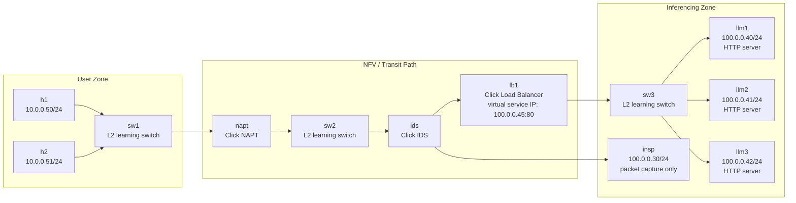
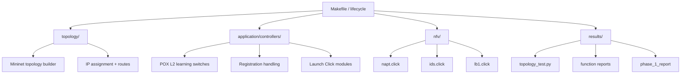
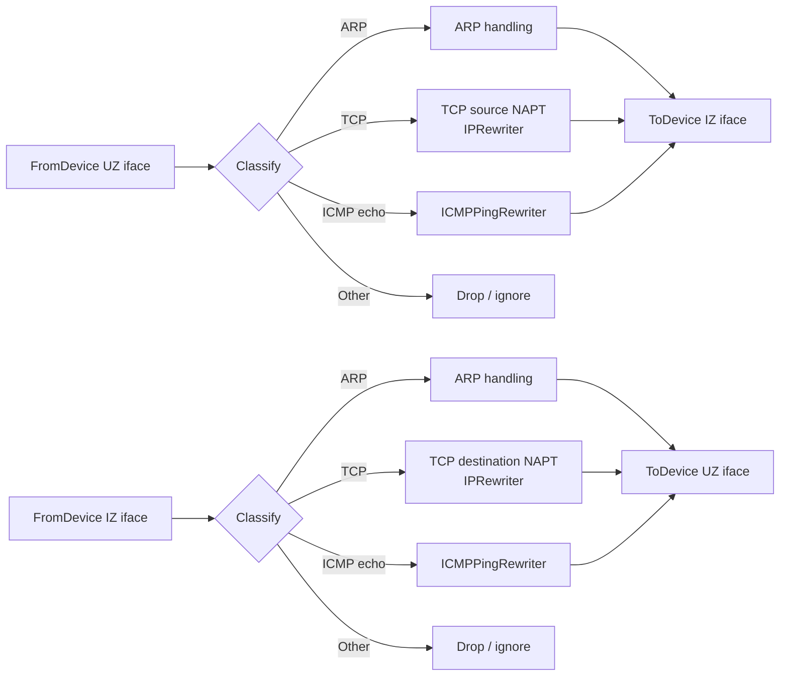
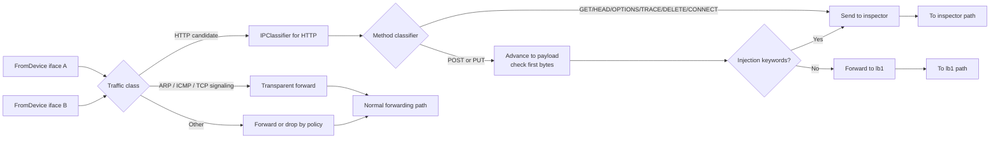
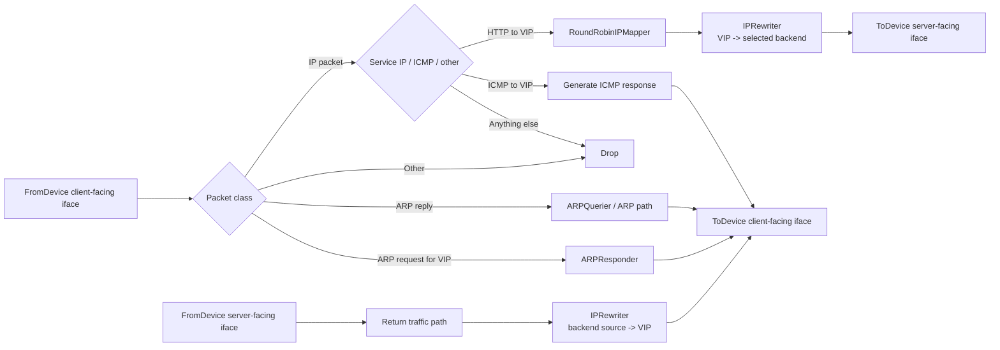
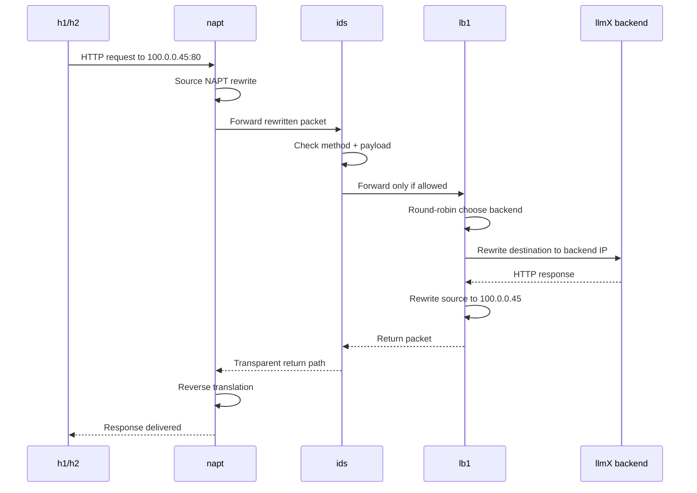
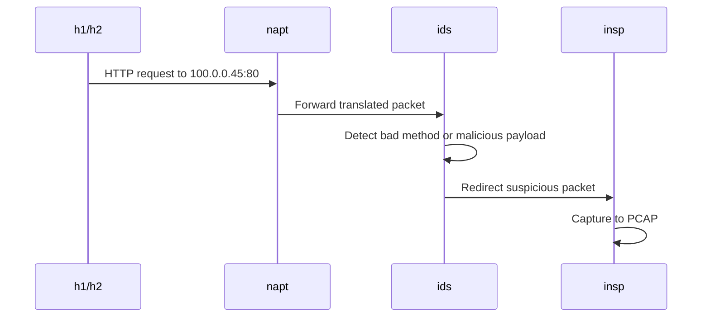
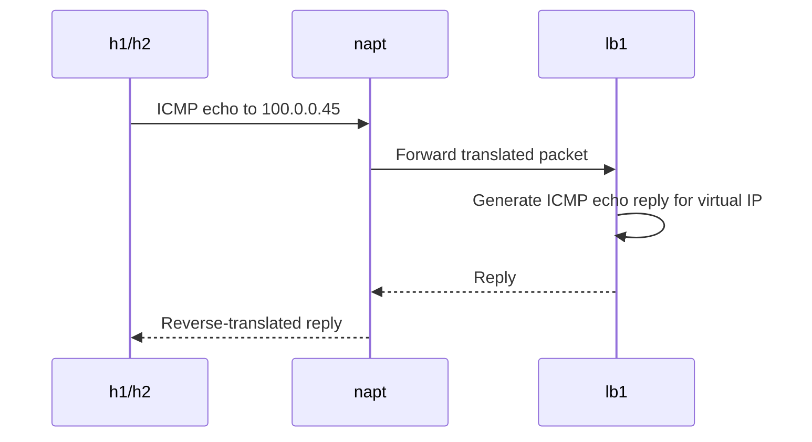
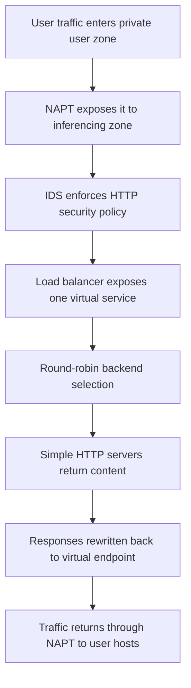

# IK2221 Phase 1 - Final System Architecture

## Purpose of this document

This document synthesizes the **final system architecture** implied by the project brief. It is written to help you understand:

1. the **major components** of the project,
2. the **responsibility of each component**,
3. the **interfaces between components**, and
4. how the whole system is expected to execute end-to-end.

> Important note:
> The project brief defines the **network topology, runtime behavior, and folder structure**, but it does **not** prescribe a full software API design. So the architecture below is a **clean implementation architecture derived from the brief**, not a claim that the PDF literally gives these exact class names or software interfaces.

---

# 1. Executive summary

The final system should be understood as a **layered NFV system** running in a Mininet-based emulated network.

At a high level:

- **Mininet** creates the topology and hosts/switches.
- **POX** acts as the control-plane orchestrator.
- **OpenFlow/OVS learning switches** provide normal L2 forwarding for `sw1`, `sw2`, and `sw3`.
- **Click modules** implement the three required network functions:
  - `napt`
  - `ids`
  - `lb1`
- **Simple HTTP servers** on `llm1`, `llm2`, `llm3` emulate the inferencing backends.
- **Inspector host (`insp`)** passively receives suspicious traffic redirected by the IDS.
- **Automated tests + reports** verify correctness and collect counters.

So the architecture is best seen as a split between:

- **Topology / infrastructure layer**
- **Control plane**
- **Data-plane NFV services**
- **Application endpoints**
- **Testing / observability / packaging**

---

# 2. Top-level architecture



---

# 3. Architectural layers

## 3.1 Infrastructure / topology layer

This layer is responsible for **creating the emulated network**.

### Responsibilities

- Instantiate the topology in Mininet.
- Create hosts, switches, and links with the required names.
- Enforce the IP plan from Figure 1.
- Ensure switch naming remains sequential (`sw1`, `sw2`, `sw3`) so DPID mapping stays predictable.
- Provide default routes for hosts where needed.

### Main components

- `topology/` Python files
- Mininet host definitions
- Mininet switch definitions
- link configuration
- IP addressing and default gateways

### Output of this layer

A fully booted emulated network containing:

- `h1`, `h2`
- `sw1`, `sw2`, `sw3`
- `napt`, `ids`, `lb1`
- `llm1`, `llm2`, `llm3`
- `insp`

---

## 3.2 Control plane

This layer is responsible for **orchestrating forwarding behavior and starting the NFV modules**.

### Responsibilities

- Run a centralized **POX controller**.
- Treat `sw1`, `sw2`, `sw3` as standard OpenFlow L2 learning switches.
- Observe Mininet node registrations.
- When `napt`, `ids`, or `lb1` appear, start the corresponding **Click module**.
- Keep the topology and NFV runtime wired together.

### What this layer is *not*

The POX controller is **not** where the NAPT/IDS/LB packet-processing logic should live.
That logic belongs in Click modules.

### Main components

- `application/controllers/baseController.py` or equivalent
- POX L2 learning logic for `sw1-sw3`
- subprocess launch of Click modules

---

## 3.3 Data-plane NFV services

This is the heart of the project.

It contains the three required network functions, each implemented as a **Click module bound to a Mininet node/interface set**.

### Required modules

- `napt.click`
- `ids.click`
- `lb1.click`

These modules are the actual packet-processing engines.

---

## 3.4 Application/service endpoint layer

These are the endpoints that make the network function pipeline meaningful.

### Components

- `llm1`, `llm2`, `llm3`
  - lightweight Python HTTP servers
  - same test pages on all servers
- `insp`
  - passive host
  - packet capture to PCAP
  - no active service logic required

### Role of the service layer

- gives the load balancer real backend targets,
- gives the IDS a sink for suspicious traffic,
- makes end-to-end testing possible.

---

## 3.5 Testing / observability / packaging layer

This layer proves that the implementation works and that it can be graded automatically.

### Responsibilities

- run automated tests,
- generate valid traffic scenarios,
- verify outcomes automatically,
- collect Click counters,
- write `<function_id>.report` files,
- produce `phase_1_report` from `make test`,
- keep the folder structure submission-compliant.

### Key files

- `results/topology_test.py`
- generated `lb1.report`, `ids.report`, `napt.report`
- generated `phase_1_report`
- root `Makefile`

---

# 4. Responsibilities of each major component

| Component | Type | Core responsibility | Key constraints / behavior |
|---|---|---|---|
| `h1`, `h2` | User hosts | Generate traffic toward the virtual service | Must sit behind NAPT |
| `sw1` | L2 switch | Connect user hosts to NAPT | Regular POX/OVS learning switch |
| `napt` | Click NFV module | Hide user-zone addresses and translate TCP/ICMP traffic bidirectionally | Must handle ARP, TCP translation, ICMP echo translation |
| `sw2` | L2 switch | Transit/core interconnect in inferencing zone | Regular POX/OVS learning switch |
| `ids` | Click NFV module | Transparently inspect HTTP traffic, allow only safe methods/payloads, redirect suspicious packets to inspector | Must pass ARP/ICMP/TCP signaling transparently |
| `insp` | Passive host | Receive suspicious traffic and capture PCAP proof | No service logic required |
| `lb1` | Click NFV module | Own virtual service IP `100.0.0.45:80`, answer ARP, answer ping, round-robin distribute allowed HTTP requests to backends, rewrite responses back to virtual IP | Must present the service as a single virtual endpoint |
| `sw3` | L2 switch | Connect load balancer to backend cluster | Regular POX/OVS learning switch |
| `llm1-3` | Backend servers | Serve simple HTTP content as inference stand-ins | Same lightweight pages on all servers |
| POX controller | Control plane | Configure learning switches and launch Click modules when Mininet nodes register | Should not implement NFV packet logic directly |
| Test harness | Validation | Drive automated scenarios and verify outcomes | Must be automatic, not manual inspection |
| Makefile | Lifecycle interface | Standardize `topo`, `app`, `clean`, `test` execution | Required for grading |

---

# 5. Clean interface model between components

The brief is written mostly in networking terms, not software-interface terms. A clean way to think about the interfaces is the following.

## 5.1 Infrastructure-to-control interface

### Interface
- **Mininet boot / node registration events**

### Producer
- topology layer

### Consumer
- POX controller

### Meaning
When Mininet starts and nodes appear, POX identifies which nodes are standard switches and which are Click-based NFV nodes.

---

## 5.2 Control-to-switch interface

### Interface
- **OpenFlow 1.0 control messages**

### Producer
- POX controller

### Consumer
- `sw1`, `sw2`, `sw3`

### Meaning
Standard L2 switching behavior is enforced here.

---

## 5.3 Control-to-NFV interface

### Interface
- **process launch / module startup**

### Producer
- POX controller

### Consumer
- Click runtime for `napt`, `ids`, `lb1`

### Meaning
POX starts the correct Click module for each special Mininet node, likely using `subprocess.Popen()`.

---

## 5.4 NFV packet interfaces

### Interface
- **raw packets on Mininet interfaces**

### Producer / Consumer
- Click `FromDevice` / `ToDevice`

### Meaning
This is the real data-plane interface. Each NFV module reads packets from device interfaces, transforms or classifies them, then emits packets back out.

---

## 5.5 IDS-to-inspector interface

### Interface
- **redirected suspicious packets**

### Producer
- IDS module

### Consumer
- `insp`

### Meaning
Suspicious HTTP requests do not continue toward `lb1`; they are forwarded to the inspector path and captured.

---

## 5.6 LB-to-backend interface

### Interface
- **rewritten server-bound HTTP traffic**

### Producer
- `lb1`

### Consumer
- `llm1`, `llm2`, `llm3`

### Meaning
The load balancer translates the virtual destination IP into one concrete backend IP chosen by round robin.

---

## 5.7 Reporting interface

### Interface
- **counter report files**

### Producer
- Click modules on teardown

### Consumer
- tests / graders / humans

### Meaning
Each NFV function emits a machine-readable or at least structured report file such as `lb1.report`.

---

# 6. Recommended software decomposition

A strong project structure would map the architecture into five implementation sections.



## Suggested ownership by folder

### `topology/`
Owns:
- Mininet node creation
- links
- IP plan
- routes
- startup helpers

### `application/controllers/`
Owns:
- POX startup
- learning-switch behavior for `sw1-sw3`
- detecting `napt`, `ids`, `lb1`
- launching Click modules

### `nfv/`
Owns:
- packet-processing logic
- ARP handling
- rewrites
- classifiers
- counters
- per-module reports

### `results/`
Owns:
- automated traffic scenarios
- assertions
- result collection
- report generation

---

# 7. Internal architecture of each NFV component

## 7.1 NAPT internal architecture

### Responsibility
Convert private user-zone addressing (`10.0.0.0/24`) into inferencing-zone addressing (`100.0.0.0/24`) and back again.

### Must support
- ARP handling
- TCP translation via `IPRewriter`
- ICMP echo translation via `ICMPPingRewriter`

### Internal view



### Architectural interpretation

The NAPT is fundamentally a **bidirectional edge translator**.
It is the boundary between the private user zone and the public-facing inferencing zone.

---

## 7.2 IDS internal architecture

### Responsibility
Inspect HTTP traffic while remaining transparent for basic forwarding traffic.

### Policy
- pass ARP, ICMP ping, and TCP signaling transparently,
- inspect HTTP requests,
- allow only **POST** and **PUT** methods,
- inspect the start of the HTTP payload for dangerous strings,
- send suspicious traffic to `insp`,
- forward safe traffic to `lb1`.

### Internal view



### Architectural interpretation

The IDS is a **policy enforcement choke point** placed before the load balancer.
It is not just passive monitoring; it actively decides whether a request may continue.

---

## 7.3 Load balancer internal architecture

### Responsibility
Expose a single virtual service endpoint at `100.0.0.45:80`, respond to ARP and ping for that service, and distribute allowed HTTP traffic across three backend servers.

### Required logic
- classify traffic into ARP request, ARP reply, IP packet, other,
- respond to ARP for the virtual service IP,
- answer ping to the virtual IP,
- for service traffic, use round-robin server selection,
- rewrite server-bound packets to the selected backend,
- rewrite return packets so clients always see the virtual service IP.

### Internal view



### Architectural interpretation

The load balancer is a **stateful virtual service endpoint**, not just a simple packet shuffler.
To the client, it should look like one machine at `100.0.0.45`.

---

# 8. End-to-end runtime flows

## 8.1 Normal allowed HTTP flow



### Meaning
This is the main success path for the system.

---

## 8.2 Suspicious or disallowed HTTP flow



### Meaning
The IDS terminates the service path here. The suspicious request should not continue to `lb1`.

---

## 8.3 Ping to the virtual service



### Meaning
The project requires the virtual service IP to feel alive even though it is backed by multiple servers.

---

# 9. What the separate interfaces should look like in implementation terms

Below is a **clean implementation interface split** that matches the brief well.

## 9.1 Topology interface

### Contract
The topology layer should expose one clear entry point:

```text
build_topology() -> running Mininet topology
```

### Inputs
- node names
- IP assignments
- link definitions
- default routes

### Outputs
- live Mininet network
- predictable switch names / DPIDs

---

## 9.2 Controller interface

### Contract
The controller layer should expose logic conceptually equivalent to:

```text
on_switch_connected(name, dpid)
on_special_node_detected(name)
launch_click_module(name, config)
shutdown_modules()
```

### Inputs
- Mininet/POX registration events
- node identity (`sw1`, `sw2`, `sw3`, `napt`, `ids`, `lb1`)

### Outputs
- switch control behavior
- spawned Click processes

---

## 9.3 NFV module interface

Each Click module should conceptually implement:

```text
read packets from interfaces
classify / transform / forward / drop
update counters
emit report on teardown
```

### Shared NFV contract
- input: packets on named interfaces
- output: packets on named interfaces
- side effects: counters, logs, report file

---

## 9.4 Test interface

### Contract
The results layer should expose automated scenarios such as:

```text
test_ping_virtual_ip()
test_round_robin_http()
test_ids_blocks_bad_methods()
test_ids_redirects_injection_payloads()
test_napt_translation()
```

### Inputs
- traffic generators (`ping`, `curl`, Scapy, etc.)

### Outputs
- pass/fail assertions
- generated reports
- final `phase_1_report`

---

# 10. What should *not* be mixed together

A good final architecture keeps these boundaries clear:

## Do not mix

- topology creation with packet-processing logic,
- POX control logic with Click NFV logic,
- backend HTTP server code with load-balancer policy,
- manual testing with automated verification,
- reporting/metrics code with topology bootstrapping.

## Keep separated

- **Mininet topology** = infrastructure definition
- **POX controller** = orchestration + switch control
- **Click modules** = real network functions
- **HTTP servers / inspector** = service endpoints
- **results/tests** = validation and evidence

---

# 11. Final recommended mental model

The cleanest mental model for this project is:



So the final system is a **service chain**:

```text
User Hosts -> NAPT -> IDS -> Load Balancer -> Backend Servers
```

with a side branch:

```text
IDS -> Inspector
```

and a supervising control plane:

```text
POX -> switches + Click module startup
```

---

# 12. Final answer in one paragraph

If you had to explain the final architecture very briefly:

> The final system should be built as a Mininet-emulated NFV service chain where `sw1-sw3` are regular POX-controlled L2 learning switches, while `napt`, `ids`, and `lb1` are separate Click-based data-plane network functions. User traffic from `h1/h2` first crosses the NAPT boundary, then passes through IDS policy inspection, and only safe traffic reaches the load balancer, which owns the virtual service IP `100.0.0.45:80` and distributes requests across `llm1-3`. Suspicious traffic is diverted to `insp`, backend servers are lightweight Python HTTP servers, and the whole project is validated through automated tests, Click counters, and report files.

---

# 13. Reflection, assumptions, and how to verify this architecture

## How this architecture was derived

I built this architecture by separating the brief into five kinds of requirements:

1. **topology requirements**,
2. **control-plane requirements**,
3. **Click module behavioral requirements**,
4. **endpoint/application requirements**, and
5. **testing/deliverable requirements**.

That leads naturally to the layered architecture above.

## Main assumptions I made

These are the main places where I had to infer structure rather than copy it directly:

- The PDF specifies **behavior**, but not a formal software-interface API.
  So the "interfaces" section above is a **clean engineering interpretation**.
- The brief strongly suggests POX mainly acts as **switch controller + Click launcher**, not as the place for NFV logic.
- The brief defines the service chain clearly enough that `NAPT -> IDS -> LB -> servers` is the right runtime abstraction.

## Potential pitfalls / alternative interpretations

### 1. Thinking of `ids`, `lb1`, and `napt` as ordinary OpenFlow switches
That would be the wrong abstraction.
They are **special Click processing nodes**, not just learning switches.

### 2. Putting too much logic into POX
The brief points toward POX being an orchestrator and OpenFlow controller, while Click performs the NFV packet work.

### 3. Treating the load balancer as only server selection
It also has to:
- own the virtual IP,
- respond to ARP,
- rewrite return traffic,
- and generate ICMP responses for ping.

### 4. Treating IDS as passive logging only
It is actually an **active gatekeeper** that decides whether traffic proceeds to `lb1` or gets redirected to `insp`.

### 5. Ignoring the testing architecture
The project is not only about runtime correctness; it is also about **automated verifiability** and proper report generation.

## Best way to verify this document against the brief

You can validate this architecture by checking whether each section maps cleanly back to the PDF:

- **Topology** -> Figure 1 and the zone/component descriptions
- **POX role** -> implementation details around `sw1-sw3` and startup behavior
- **Click NFV roles** -> pages describing `lb1`, `ids`, and `napt`
- **Service endpoints** -> notes about Python HTTP servers and inspector capture
- **Testing/reporting** -> testing + deliverable sections

A strong verification question is:

> "For every component in this document, can I point to a required runtime behavior or deliverable in the assignment brief?"

If yes, the architecture is faithful.

